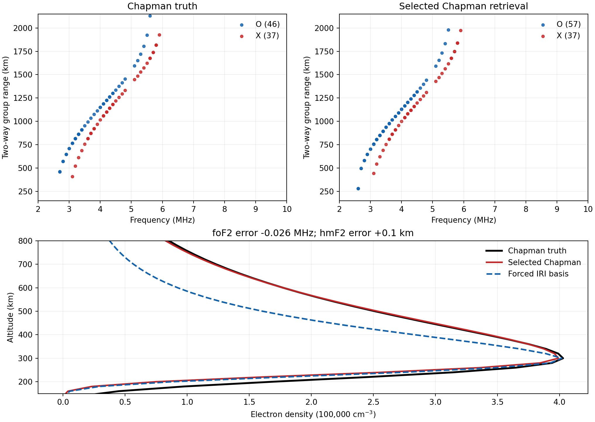

# Result in brief

The retrieval was tested against an **analytic generalized Chapman density
field**, generated without IRI density. In four idealized one-dimensional
Chapman cases, the Chapman branch was selected from ionogram-range residuals
in all four and achieved **0.020 MHz foF2 mean absolute error, 3.15 km hmF2
mean absolute error, and 0.23% mean peak-normalized topside RMS**. Forcing the
IRI-derived basis instead raised these to 0.066 MHz, 31.0 km, and 8.45%.

One full three-dimensional O/X ray-tracing case tested whether this advantage
survives the actual ionogram generator. After an ionogram-derived height
refinement, the selected Chapman candidate had **−0.0265 MHz foF2 error,
+0.10 km hmF2 error, −0.93% peak-density error, and 0.51% peak-normalized
topside RMS**. The IRI-only candidate had 17.6% topside RMS in that case.

# Truth, separation, and scope

The full-ray truth has analytic foF2 5.7 MHz, hmF2 300 km, bottomside scale
70 km, topside scale 95 km, and a 0.45 upper-tail curvature. It is horizontally
uniform on a 27 × 17 × 43 latitude–longitude–altitude grid with 20 km altitude
spacing. The independent [truth generator](prepare_chapman_truth.py) computes
its density directly from a Chapman expression; it does not import the
retrieval's Chapman class or load IRI density. The numerical density was
checked to match the already traced grid exactly.

The [retrieval](chapman_model_validation.py) reads the saved accepted O/X
returns and a precomputed IRI basis. It does not read the truth density or
parameters during fitting or height refinement. Full-ray ionogram scores are
computed before the truth file is opened for density evaluation. Truth and
candidates share the same ray tracer, option-D fan, 1 km homing tolerance, and
2–10 MHz sweep at 100 kHz spacing.

This is a test against a model **different from IRI**, but the successful
branch contains the same generalized Chapman topside formula as the analytic
truth. It is an in-family Chapman test, with a deliberately different fixed
bottomside scale. It does not establish accuracy for an arbitrary empirical
model or a horizontally wavy field.

# Four scalar Chapman profiles

The separate scalar test spans 45–95 km topside scales and one curved tail.
Its forward operator integrates group range through each analytic profile;
the retrieval fits the ionogram without seeing the profile parameters. The
Chapman branch wins the O-mode ridge-error comparison in all four cases.

| Truth topside scale / curvature | Chapman foF2 error | Chapman hmF2 error | Chapman topside RMS | Forced IRI-basis topside RMS |
|:--|--:|--:|--:|--:|
| 45 km / 0 | −0.0314 MHz | +3.35 km | 0.37% | 14.48% |
| 70 km / 0 | −0.0250 MHz | +4.02 km | 0.29% | 6.45% |
| 95 km / 0 | −0.0182 MHz | +3.68 km | 0.21% | 7.01% |
| 75 km / 0.5 | +0.0066 MHz | −1.54 km | 0.05% | 5.86% |

\clearpage

# Full 3-D O/X retrieval

The 800 km sounder is inside a comparatively dense topside: the truth plasma
frequency there is about 2.62 MHz. Its first accepted O return is at 2.7 MHz.
The fast scalar O-mode proposal estimated hmF2 at 267.96 km, about 32 km low;
it cannot accurately represent the near-spacecraft magnetoionic group delay.
Full-ray checks of that proposal and two bounded height steps were therefore
essential. The initial full-ray Chapman candidate's predicted O/X ranges were
64.28 km too long at the median of 37 common frequency bins from 3.2 to
5.2 MHz. Dividing this measured two-way range residual by two proposed a
+32.14 km height step. That step was calculated from ionograms alone.

The final choice minimizes the dimensionless O/X accepted-return score:
55% symmetric return distance, 25% last-return frequency, and 20% common-bin
median-range error. Every accepted return enters the distance term. Smaller
is better; the score is not a density error.

| Candidate | Full-ray score | foF2 error | hmF2 error | Topside RMS |
|:--|--:|--:|--:|--:|
| **Chapman, O proposal + measured 32.14 km step** | **0.200** | **−0.0265 MHz** | **+0.10 km** | **0.51%** |
| Chapman, O proposal + 20 km | 0.263 | −0.0265 MHz | −12.04 km | 2.02% |
| Chapman, O proposal + 40 km | 0.276 | −0.0265 MHz | +7.96 km | 1.85% |
| Chapman, unrefined O proposal | 0.457 | −0.0265 MHz | −32.04 km | 5.83% |
| Chapman, unrefined O/X proposal | 0.472 | −0.0226 MHz | −32.32 km | 5.74% |
| Forced IRI basis | 0.619 | +0.0010 MHz | −3.09 km | 17.57% |

The truth's O/X last returns are 5.7/5.9 MHz; the selected candidate gives
5.6/5.9 MHz. It also has 57 accepted O returns versus 46 in truth, including
an extra low-frequency return. Thus the density match is strong while the
ionograms still have visible discrepancies. The assumed 55 km candidate
bottomside differs from the 70 km truth bottomside, which is weakly observed
by topside reflections. Peak errors in the table use the continuous analytic
truth and fitted profile parameters; topside RMS uses the 20 km density grids
from truth hmF2 to 600 km, normalized by truth peak density.

\clearpage

# Ionograms and density cut

The upper panels plot **all** accepted O (blue) and X (red) returns at their
100 kHz frequencies and 1 km rounded group-range bins. The lower panel shows
the analytic truth, the score-selected Chapman retrieval, and the forced
IRI-basis alternative at the sounder. The close Chapman topside agreement and
the much thinner IRI-basis topside are visible directly.

{width=98%}

This single full-ray case is exploratory; the height candidates were developed
while inspecting its ionogram. A prospective test should fix the search rule
first, then use new Chapman parameters and horizontal structure. A different
physical model family would be needed to test broader out-of-family transfer.
