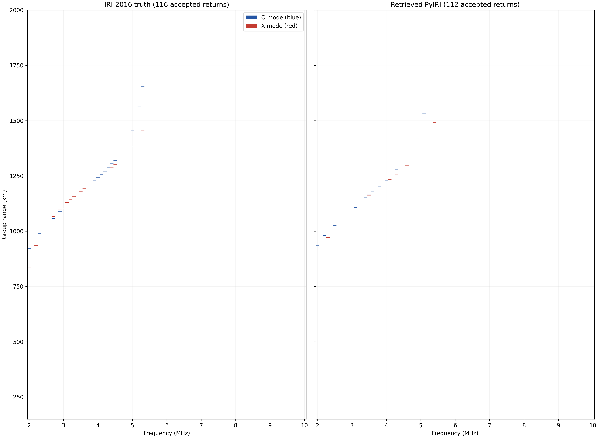
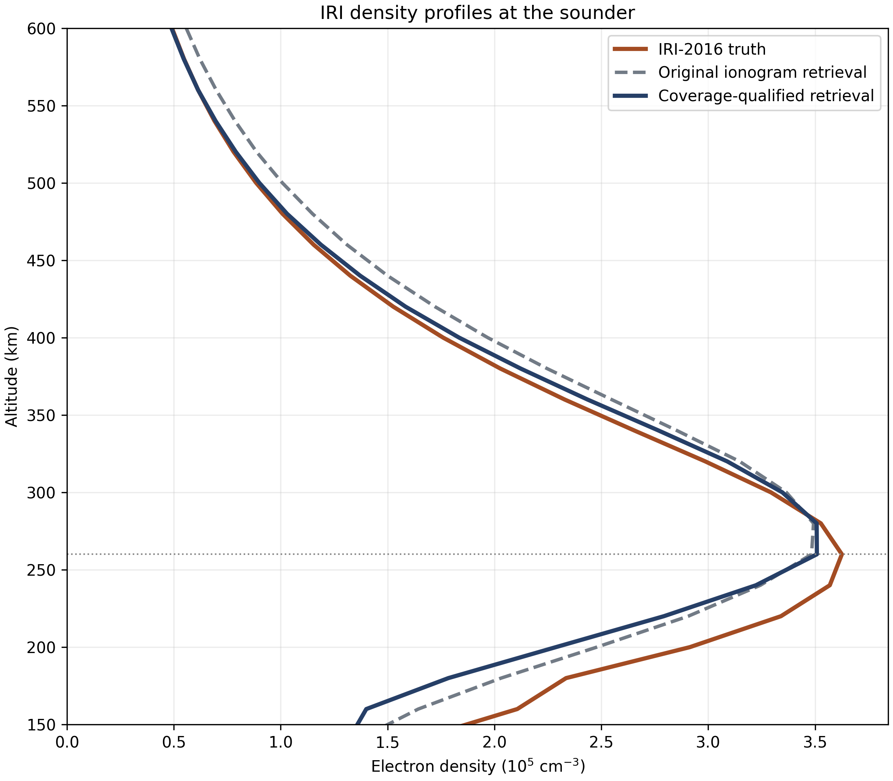
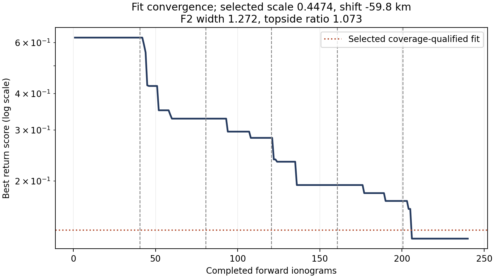

# Result

We extended the IRI-2016 test from 160 to 240 forward ionograms. An independent topside-width ratio lets a PyIRI candidate change its density gradient above F2 without forcing the same change below F2. The new retrieval was selected from accepted ionogram returns alone. It improves the retrieved **topside** density and the O/X return curves. Bottomside density remains poorly constrained by this topside sounding geometry.

| Measure | IRI truth | Original retrieval | Refined retrieval |
|:--|--:|--:|--:|
| Accepted O / X returns | 56 / 60 | 41 / 56 | 54 / 58 |
| O / X maximum returned frequency, MHz | 5.4 / 5.4 | 5.2 / 5.6 | 5.2 / 5.4 |
| O / X median-range MAE, km, shared frequencies | — | 15.1 / 19.8 | 10.5 / 14.0 |
| Original ionogram score, same formula | — | 0.2014 | 0.1498 |
| F2 peak altitude, km | 260 | 280 | 260 |
| foF2 from peak density, MHz | 5.407 | 5.307 | 5.319 |
| Topside RMS density error / IRI peak | — | 4.09% | 1.76% |
| Below-peak RMS density error / IRI peak | — | 10.96% | 15.67% |

The unchanged original-score formula falls from 0.2014 to 0.1498, so the before/after score comparison is on the same scale. The refined retrieval's remaining O-mode nose error is 0.2 MHz. Its improved topside profile is evaluated independently of the score on page 3.

\clearpage

# Ionogram comparison

The pair below shows the independent IRI truth and selected retrieval over the complete 2–10 MHz sweep. O-mode returns are blue; X-mode returns are red. Every accepted return is drawn in a 0.1 MHz by 1 km display cell, starting at 150 km group range. Darker marks contain coincident returns. The 1 km homing gate is unchanged.

{width=98%}

The revised model recovers 54 of the truth's 56 O-mode returns and 58 of 60 X-mode returns. Its X-mode maximum returned frequency now matches 5.4 MHz. The return curves still differ near the noses and at several low frequencies; the group-range error is not zero.

\clearpage

# Density-profile comparison

The figure compares electron density at the sounder. The original retrieved profile placed F2 one 20 km grid cell high and overestimated much of the topside density. The refined profile places F2 at 260 km and follows IRI more closely from the peak to 600 km. Its peak density is 350,853 cm^-3 versus 362,539 cm^-3 for IRI, giving foF2 5.319 versus 5.407 MHz: an error of -0.088 MHz (-1.62%).

{width=77%}

Topside peak-normalized RMS error fell from 4.09% to 1.76%. Below the IRI peak, the same metric rose from 10.96% to 15.67%; over the whole 150–600 km profile it rose from 6.26% to 7.47%. The improvement is therefore specific to the topside and return geometry. The bottomside error is visible in the plot and should not be hidden by the topside number.

The refined candidate has density scale 0.44744, F2-height shift -59.80 km, common F2 width scale 1.27197, and topside width ratio 1.07310. These are transforms of the PyIRI background, not IRI input parameters.

\clearpage

# Search, independence, and limits

The first 160 candidates used the previous density-scale, height-shift, and common-width search. We then evaluated 40 candidates spanning a distinct topside width. After inspecting their **ionogram return counts**, we added a per-mode count term and evaluated 40 more candidates around the best count-aware fits. The revised score is `0.50D + 0.15N + 0.20R + 0.15C`, where `D` is symmetric accepted-return distance, `N` is maximum-frequency mismatch, `R` is shared-frequency median-range mismatch, and `C` is mean relative O/X return-count error. This score change was exploratory and was made before reading the withheld density for the new candidates.

For final selection we require each modeled O/X return count to be within 10% of the observed count, then take the smallest revised score. Thirty-four of 240 candidates satisfy that rule. The selected score is 0.1353. The unconstrained minimum is 0.1265, but it has only 40 O and 53 X returns, so it fails the coverage rule. The orange dotted line in the convergence plot marks the selected score; the blue curve includes all candidates, including those that fail the count rule.

{width=80%}

Truth electron density comes from public Fortran IRI-2016 1.11.1; all candidate densities come from PyIRI. The scored truth ionogram contains no generating parameters, and the search never reads the IRI density grid. Geometry, magnetic field, ray tracer, and homing are shared, so this is an independent-density synthetic test rather than an independent measurement. The model family and score were revised after inspecting earlier test results; these numbers are exploratory and do not establish performance on untouched cases.

All 80 new Cartman jobs completed successfully. The first 40-job group took 289 seconds; the second took 1,262 seconds because some near-critical sweeps were much slower. Per-job server ownership and permission checks found zero violations. The saved candidate-score table, selected accepted-return NPZ, and figures permit direct review.
