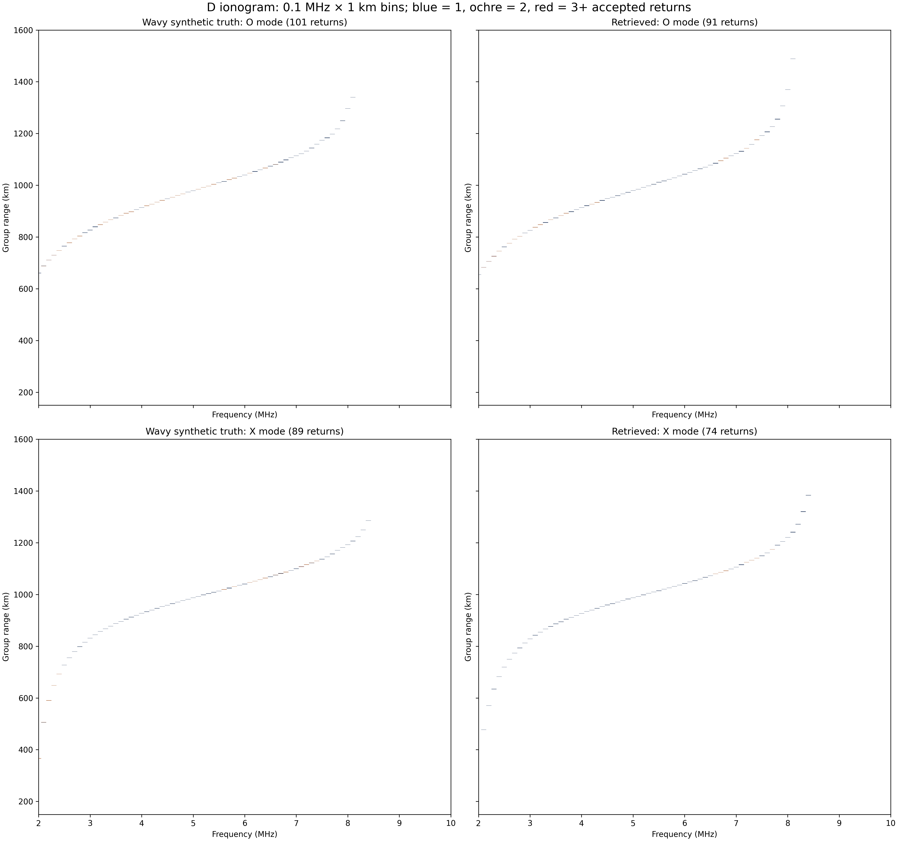
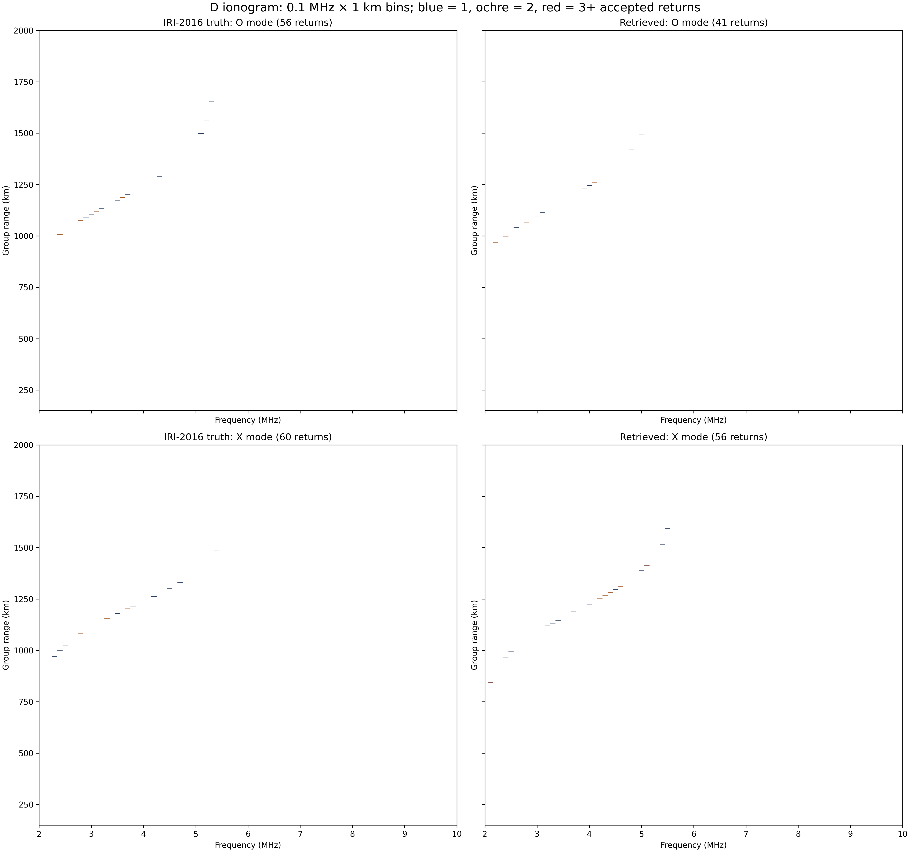
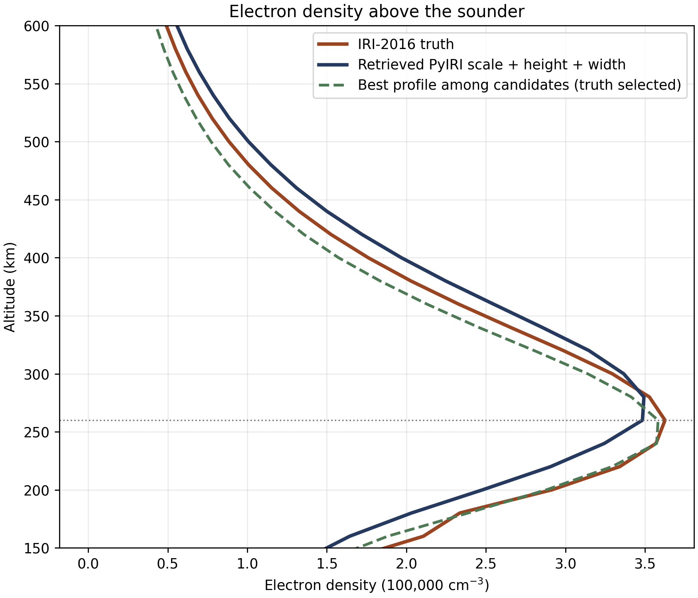
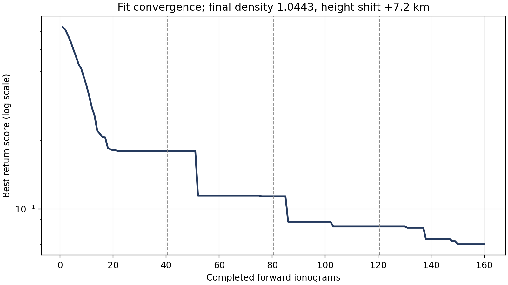
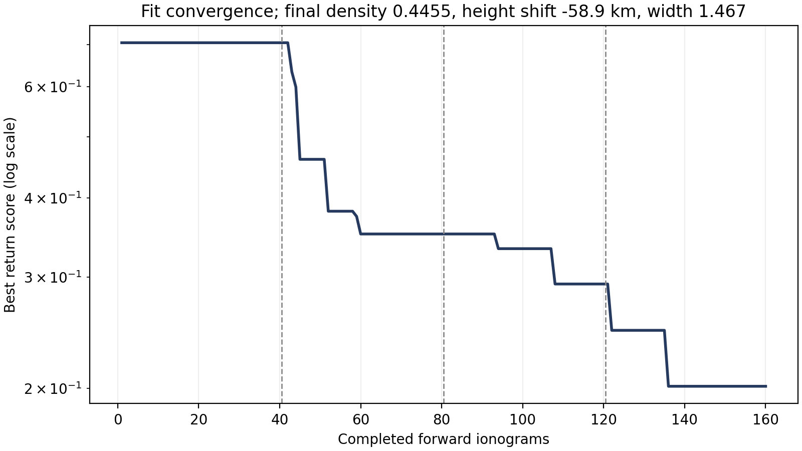

# Summary

We fitted vertical topside ionograms from 2 to 10 MHz, at 0.1 MHz spacing, using the D equal-area fan and a 1 km homing gate. The search evaluated 40 initial candidates and three 40-candidate refinements for each case. Every accepted O- and X-mode return enters the score and the figures; display cells are 0.1 MHz by 1 km, starting at 150 km group range.

| Case | First 40 score | Final 160 score | Selected model parameters |
|:--|--:|--:|:--|
| Wavy synthetic | 0.1792 | 0.0702 | Scale 1.0443; height +7.20 km |
| IRI-2016 | 0.7049 | 0.2014 | Scale 0.4455; height -58.9 km; width 1.4667 |

The wavy case tests an omitted 18% wave perturbation. Its truth and candidates share the PyIRI background and ray tracer, so this is an out-of-family synthetic test, not an independent-density test. The independent-density case uses the public Fortran IRI-2016 model for the truth grid and PyIRI for every retrieval candidate. Geometry, magnetic field, ray tracer, and homing algorithm are shared. Neither case uses a measured ionogram.

The IRI truth was blinded before the fit: the scored NPZ has no density-scale, height, width, wave, or grid parameters. A fresh direct IRI profile at the sounder agrees with the saved grid interpolation to 0.0097% of peak density over 150–600 km. The fit never reads that density grid; it sees accepted returns only. The width parameter was added after inspecting a preliminary IRI profile comparison, so this is an exploratory model-family test, not a fully untouched validation of model design.

# Search and score

The first library samples density scale at zero height shift. The O/X maximum returned frequency seeds density; the low-frequency range curve seeds height. Forty stratified candidates refine these two parameters. For IRI, the next 40 sample density, height, and F2 profile width; the final 40 refine the best width candidates. The last ten initial IRI candidates finished after the width proposal was generated from the first 70 evaluations; all 160 results are included in the final ranking.

The fixed ionogram score combines symmetric accepted-return distance (55%), reflected-frequency nose (25%), and median range-curve difference (20%). It is a fit criterion, not a density-error metric. We evaluate the density profile independently after selecting the lowest ionogram score.

\clearpage

# Wavy synthetic ionosphere

Truth: density scale 1.000, F2-height shift +10.0 km, wave amplitude 0.18, phase 0.6 rad, bearing 45°. The candidates have zero wave amplitude. The selected scale is 1.0443 and height shift +7.20 km. Both O and X noses match the truth (8.1 and 8.4 MHz), but the selected ionogram has 165 returns versus 190 in the truth and mean range-curve errors of 8.8 km in each mode on shared frequencies. The residual and parameter bias show what the two-parameter model cannot absorb.

{width=98%}

\clearpage

# Independent IRI-2016 ionosphere

The IRI-2016 1.11.1 electron-density grid was generated at 2010-01-01 12:00 UTC on the Cartman D-case axes, then supplied only to the truth forward run. PyIRI generated all candidate grids. The two programs supply genuinely different electron densities: at the sounder, IRI peaks near 260 km and 363,000 cm^-3, while the unadjusted PyIRI background peaks near 320 km and 785,000 cm^-3. The independent truth has 116 accepted returns and O/X noses of 5.4 MHz.

The selected candidate after 160 evaluations has 97 returns, O/X noses 5.2 / 5.6 MHz, and 15.1 (O) and 19.8 (X) km mean range-curve error on shared frequencies. The score fell from 0.7049 to 0.2014, but the remaining difference in this figure is substantial.

{width=98%}

\clearpage

# Density recovery and limits

The figure compares IRI with the *ionogram-selected* profile at the sounder. The dashed green curve is an oracle diagnostic: it is the evaluated candidate with smallest **true profile error**, selected using the withheld IRI grid only after the search. It is not a retrieval. The horizontal dotted line marks IRI's F2 peak. A topside sounder mainly constrains density at and above this peak; bottomside density below it is weakly observed.

{width=67%}

| Profile measure at the sounder | IRI truth | Selected candidate |
|:--|--:|--:|
| F2 peak altitude | 260 km | 280 km |
| F2 peak density | 362,539 cm^-3 | 349,282 cm^-3 |
| RMS error, peak–600 km / IRI peak | — | 4.1% |
| RMS error, 150 km–below peak / IRI peak | — | 11.0% |
| RMS error, 150–600 km / IRI peak | — | 6.3% |

The ionogram-selected profile has 4.1% peak-normalized RMS error on the topside. Its F2 peak is one 20 km grid interval higher and its peak density is 3.7% lower than IRI. Below the peak the error grows to 11.0%, consistent with the limited bottomside sensitivity of a topside ionogram. The diagnostic oracle has 3.7% full-profile error but a worse 0.333 ionogram score; it uses the withheld truth for selection and is not a retrieval.

\clearpage

# Convergence and reproducibility

{width=75%}

{width=75%}

The full accepted-return NPZ files, all 160 candidate scores per case, density grids, and truth-source audit accompany this report. The audit confirms that the scored IRI truth has no generating parameters, that the density sources are IRI-2016 and PyIRI, and that their grid axes agree exactly. A separate scan checked 8,241 Cartman project paths and found no ownership or permission violations. During IRI grid construction, 459 of 19,737 nonpositive or invalid samples were repaired; a fresh direct IRI sounder profile has no invalid samples from 150 to 600 km.

The density builder (`build_iri2016_truth_density.py`) uses the public `iri2016` package and the axes exported by `export_d_case_axes.py`. The forward ionograms come from `generate_synthetic_truth_returns.py`; the searches and diagnostics are in `fit_d_ionogram.py`, `fit_d_ionogram_width.py`, and `analyze_d_inverse_fit.py`. Sharing the ray tracer limits forward-model independence. A single topside view also leaves bottomside shape and some horizontal structure unresolved.
