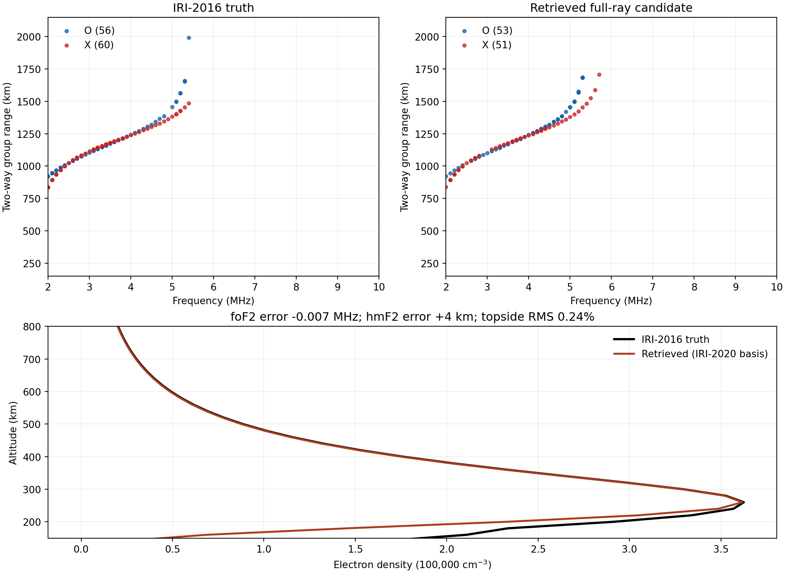

# Summary

This prototype fits **foF2, hmF2, and topside shape independently** instead
of restricting candidates to a shifted, stretched prior. One branch uses four shape
components learned from 100 global IRI-2020 profiles; a second uses a
generalized Chapman F2 layer. The code tests both branches with O-mode and
X-mode return ranges and selects 3-D candidates using all accepted O/X returns.
The 1 km homing gate and 2--10 MHz sweep at 0.1 MHz spacing are unchanged.

The shape test on eight separate IRI-2016 profiles is strong: the IRI basis has
**4.8 km mean absolute hmF2 error** and **0.11% peak-normalized topside RMS**
when both truth and retrieval use a scalar vertical ray operator. A single
Chapman layer gives 18.1 km and 11.16% on these profiles. The comparison shows
that one width parameter was too restrictive. The full 3-D O/X check is
reported separately below; the scalar numbers do not measure magnetoionic
ray-tracing accuracy.

# Data and independence

The basis was trained on IRI-2020 density sampled at 5 latitudes, 5 longitudes,
and 4 seasons/local times in 2011. F10.7 was fixed at 120. Each profile was
aligned at its F2 maximum, divided by its peak density, and sampled every 5 km
from the peak to 600 km above it. The validation ionograms and density grid
come from a separately generated IRI-2016 case at 2010-01-01 12:00 UTC. The
fitting stage reads only its accepted-return file and an independent PyIRI
background for horizontal variation. It does not read the IRI-2016 density
grid; density is opened during evaluation.

IRI-2016 and IRI-2020 are related versions of one empirical model, so this is
a held-out code-version and location test, **not an independent model-family
test**. The 3-D truth and candidate ionograms share the ray tracer, fan, and
homing code. The scalar tests use a separate tabulated-profile integrator but
the same vertical cold-plasma equation. No measured ionogram is used.

# Retrieval method

For the IRI branch, the log density above the peak is

$$\log\!\left[N(h_m+s)/N_m\right]
  =\mu(s)+\sum_{k=1}^{4} a_k e_k(s),\qquad
  N_m=(f_o/0.00898)^2\;\mathrm{cm}^{-3}.$$

Here $\mu$ is the mean normalized IRI profile and $e_k$ are its first four
principal components, scaled so $a_k=1$ is a one-standard-deviation change.
The independent fitted parameters are $f_o$, $h_m$, and the four $a_k$. A
55 km Chapman bottomside supplies density below the peak; that region is weakly
constrained by topside reflections. The competing Chapman branch fits its own
topside scale height and curvature.

\clearpage

# Search and forward checks

The fast proposal stage computes vertical two-way group range by quadrature
through each candidate density. It fits per-frequency median O/X ranges with
a robust loss, a soft 100 kHz nose constraint, and weak shape priors. The
scalar X operator has nuisance frequency and range offsets because it omits
magnetoionic propagation; those offsets are not interpreted as plasma
parameters. The highest return bin is excluded from the fast range residual
because group delay is singular at the limiting frequency. For full-ray
checks, each column receives a tunable fraction $g$ of PyIRI's smooth
horizontal peak-frequency and peak-height variation. We estimate PyIRI's
local peak with a three-point quadratic and set
$f_o(x)=f_o(x_s)[f_{o,\mathrm{prior}}(x)/f_{o,\mathrm{prior}}(x_s)]^g$ and
$h_m(x)=h_m(x_s)+g[h_{m,\mathrm{prior}}(x)-h_{m,\mathrm{prior}}(x_s)]$.
The tested gains are 0, 0.15, 0.30, 0.5, and 1. Candidate density is then
traced by the option-D 3-D O/X fan. One bounded height refinement converts
the median shared-frequency O/X group-range residual to an approximate
reflector-height step using $\partial R/\partial h_m\simeq-2$; both 75% and
100% steps receive full-ray checks. Final selection uses the existing
score: 55% symmetric accepted-return distance, 25% last-return-frequency
error, and 20% common-frequency median-range error. **Every accepted return**
enters the full-ray distance score.

# Shape and family validation

| Truth family / scalar test | Selected branch | hmF2 MAE | foF2 MAE | Mean topside RMS |
|:--|:--|--:|--:|--:|
| Eight IRI-2016 profiles | IRI basis, 8/8 | 4.80 km | 0.0069 MHz | 0.11% |
| Same eight, forced single Chapman | Chapman | 18.11 km | 0.0400 MHz | 11.16% |
| Four analytic Chapman profiles | Chapman, 4/4 | 3.15 km | 0.0203 MHz | 0.23% |
| Same four, forced IRI basis | IRI basis | 31.04 km | 0.0663 MHz | 8.45% |

The analytic Chapman cases span 45--95 km topside scales and one curved tail.
The family choice above is made from range residuals, not from truth density.
These are idealized scalar ionograms; they establish basis flexibility and
family selection, then the full 3-D case tests transfer to the actual O/X
generator.

{width=98%}

\clearpage

# Full 3-D O/X check

The held-out IRI-2016 ionogram contains 56 O and 60 X accepted returns.
Candidates were traced through complete 3-D density grids and ranked by the
O/X ionogram score, before opening the truth density. The score combines
symmetric distance between all accepted returns (55%), last-return frequency
(25%), and median range at common frequencies (20%). Smaller is better; it
is a dimensionless selection score, not a density-error estimate.

| Candidate | Full-ray score | foF2 error | hmF2 error | Topside RMS |
|:--|--:|--:|--:|--:|
| **Selected: IRI basis, zero gradient, full height step** | **0.0881** | **−0.0065 MHz** | **+4.26 km** | **0.24%** |
| IRI basis, 0.15 gradient, full height step | 0.0887 | −0.0062 MHz | +4.95 km | 0.11% |
| IRI basis, zero gradient, 75% height step | 0.1183 | −0.0085 MHz | +2.19 km | 0.81% |
| Previous shifted-PyIRI retrieval | 0.1498 | — | — | — |
| IRI basis, 0.15 gradient, before height step | 0.1865 | −0.0120 MHz | −4.85 km | 2.57% |
| Single Chapman candidate | 0.2119 | −0.0596 MHz | −37.11 km | 18.73% |

Density errors in this table are **diagnostics after selection**. The selected
profile has foF2 5.4015 MHz versus 5.4080 MHz in truth, and hmF2 261.55 km
versus 257.29 km. The peak-density error is approximately −0.24%, from the
squared foF2 ratio. Topside RMS is the density RMSE from truth hmF2 to 600 km,
divided by truth peak density. The selected profile's broader 150–600 km RMS
is 10.35%, exposing the assumed 55 km Chapman bottomside; the vertical
topside ionogram does not constrain that region well. The 0.15-gradient fit
has a marginally higher ionogram score yet a slightly smaller topside RMS,
so these two candidates are not meaningfully separated by this one case.

The selected O-mode nose is 5.4 MHz, matching truth. Its X-mode last return
is 5.7 MHz versus 5.4 MHz in truth. The remaining nose and high-range
differences in the figure are real residuals, even though the overall score
improved by 41% against the previous retrieval. The Chapman candidate's
plausible 0.212 ionogram score but 37 km peak-height error illustrates the
shape/height ambiguity that motivated the IRI-derived basis.

\clearpage

The figure places every accepted O and X return at its exact 100 kHz frequency
and rounded 1 km group-range bin. Both modes are overlaid in each ionogram;
the density cut is at the sounder position. Peak frequencies and heights use a
three-point quadratic around the maximum of the 20 km forward grids.

{width=98%}

# Limits and next step

The inverse still has limited bottomside information and can trade local shape
against 3-D refraction. The scalar X offsets are proposal-stage corrections,
not a substitute for the full magnetoionic solver. The current comparison is
exploratory because the new model family was developed after inspecting an
earlier case at this location. A fresh location and epoch, held out before
method tuning, are needed for a prospective accuracy claim. Joint vertical
and oblique fitting across multiple sounder positions should help separate
peak height from horizontal gradient and topside curvature.
