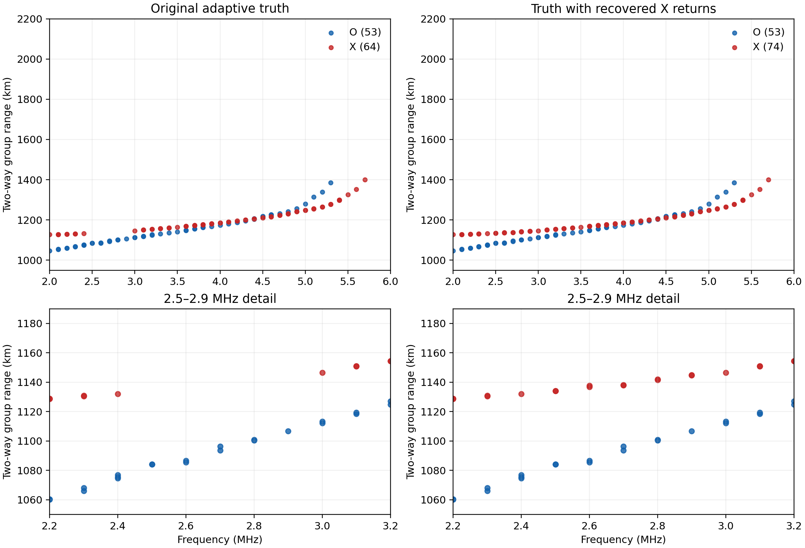

# Summary

A vertical, mode-resolved synthetic ionogram was generated from a public
**NeQuick-G** density profile that was not included in the retrieval basis.
The April validation profile was chosen at 62°S, 8°W, 13 UT with Galileo
broadcast Az = 64. The profile was replicated horizontally over the existing
ray grid. After full O/X ray checks of eight candidates, the minimum-score
retrieval had **−0.032 MHz foF2 error, −13.9 km hmF2 error, and −1.1% peak
density error**. Its peak-normalized topside RMS was **7.9%** from the true F2
peak to 600 km. At 800 km it still underestimated density by **42.5%**.
The selected O/X ionogram score was 0.181; smaller is better.

This is a useful out-of-input-family check, but it does not establish robust
recovery of the upper topside. The 2–10 MHz sweep contains little direct
information about plasma whose local frequency is below 2 MHz. Several
different upper tails therefore give plausible ionograms.

# Truth and independence

The truth generator used the public `tpl2go/NequickG` implementation at commit
`1d1783412ed9` (full hash in `provenance.json`). Its Python 2 source was
converted mechanically with `lib2to3`; the model equations were not edited.
The retrieval's eight-slope, monotone log-density spline contains **no
NeQuick profiles, coefficients, or source code**. The fitting script reads
only the saved O/X returns. It wrote `selection.json` with all candidate
scores and the selected name **before** opening the truth density or NeQuick
peak parameters. The earlier January and July NeQuick cases informed method
development; this April location and time were held out from density-based
assessment until that selection.

All truth and candidate ionograms use the same 3-D PyLap ray tracer, option-D
equal-area vertical fan, 2–10 MHz frequencies at 100 kHz spacing, and 1 km
homing gate. The forward physics is therefore shared. This experiment tests
independence of the **density model**, not independence of the ray tracer.
Replicating one NeQuick profile over the horizontal grid also removes real
horizontal structure; it is a controlled vertical-profile test, not a global
NeQuick simulation or a measured ionogram.

# Retrieval and selection

The proposal fit represents the density above hmF2 with eight positive
piecewise log-density slopes. foF2, hmF2, and those slopes are fitted to the
median O-mode group range at each accepted frequency using a fast scalar
vertical-ray integral. A weak penalty discourages sharp slope changes. The
tail-regularized branch enforces a minimum positive gradient in the upper
three intervals to avoid an unphysical plateau. Its 55 km Chapman bottomside
is a fixed nuisance shape. The scalar fit is only a proposal: it omits X-mode
magnetoionic bending and is not the final score.

The candidate set also tested foF2 anchors inferred from the X-mode last
return, subject to the lower bound supplied by the O-mode last return. Three
additional candidates imposed generic 0.4, 0.8, or 1.2 MHz plasma-frequency
anchors at the 800 km spacecraft. These were **assumed tail priors**, not
measured plasma frequencies. Every candidate was then traced with full O/X
rays and ranked by the same accepted-return score: 55% symmetric return
distance, 25% mode-wise last-return frequency, and 20% common-frequency
median range error. All accepted rays enter the score.

\clearpage

# Ionograms and density cut

{width=98%}

The score-selected spline follows the low and middle frequency return ridges
and places foF2 within 32 kHz of the model value. It retrieves a lower peak
height and a steeper topside. The large remaining density difference above
500 km is visible even though its contribution to peak-normalized RMS is
small.

\clearpage

# Quantitative result

The April NeQuick-G model has foF2 **5.532 MHz** and hmF2 **243.2 km**.
The table reports density errors only after the ionogram-score selection.
Topside RMS is normalized by the true peak density and covers the true peak
through 600 km. One mode-frequency bin means one 100 kHz frequency in one
polarization.

| Candidate | O/X score ↓ | foF2 Δ (MHz) | hmF2 Δ (km) | Peak Δ | Top RMS |
|:--|--:|--:|--:|--:|--:|
| Legacy O-nose spline | 0.182 | −0.032 | −13.9 | −1.1% | 7.9% |
| **Selected tail-regularized spline** | **0.181** | **−0.032** | **−13.9** | **−1.1%** | **7.9%** |
| X-anchor low | 0.233 | −0.024 | −44.2 | −0.9% | 20.3% |
| X-anchor mid | 0.228 | +0.120 | −27.8 | +4.4% | 7.3% |
| X-anchor high | 0.243 | +0.216 | −49.1 | +8.0% | 16.8% |
| 0.4 MHz upper anchor | 0.217 | +0.119 | −56.2 | +4.3% | 19.7% |
| 0.8 MHz upper anchor | 0.241 | +0.120 | −35.6 | +4.4% | 10.4% |
| 1.2 MHz upper anchor¹ | 0.241 | +0.120 | −23.4 | +4.4% | 5.6% |

¹ Four interior mode-frequency bins remained unhomed after the candidate's
gap search, so its score has that search limitation. Its score is still 0.060
above the selected candidate's score.

The selected density is 13,548 cm$^{-3}$ at 800 km, versus 23,567 cm$^{-3}$ in
NeQuick-G. The relative bias grows from −11.5% at 300 km to −19.4% at
400 km, −31.8% at 600 km, and −42.5% at 800 km. This is the unresolved
topside-shape error; a small peak-density error should not be read as a good
upper-tail retrieval.

# Interpretation

The flexible spline can represent density shapes outside the IRI or Chapman
input families, and the held-out April case recovers the peak reasonably well.
The full-ray score does **not** reliably choose the correct upper tail from
this 2 MHz lower sweep limit. Extending observations below 2 MHz or adding an
independent upper-plasma constraint would test and reduce that ambiguity.
Further tuning on this April truth would make it a development case; a new
held-out profile would then be needed for a prospective check.

\clearpage

# Forward-model quality control

Interior frequency gaps in the truth and candidates were searched with
full-fan seeds and 20 kHz continuation. Only rays actually traced and homed
at their displayed 100 kHz frequency were added. The April truth gained
14 accepted returns and had no remaining interior gaps. Seven candidate
gap passes closed their gaps; one unselected candidate retained four
unrecovered mode-frequency bins. Jobs ran in `chartat1`'s private Cartman run
area, with at most two large ray processes active.

The earlier January NeQuick truth sweep had a five-bin X-mode gap from 2.5
through 2.9 MHz. There were returns at 2.4 and 3.0 MHz. A dense fan found
rays at 2.6–2.8 MHz; 20 kHz continuation from 2.4, 2.6, 2.8, and 3.0 MHz
found two accepted X rays at **each** missing 100 kHz frequency. All ten
passed the original 1 km gate; the largest miss was 780 m. Figure 2 shows
the original and corrected truth ionograms, including a close view. The
previous January retrieval score table used the incomplete truth and remains
preliminary until its candidates receive the same recovery pass.

{width=98%}
