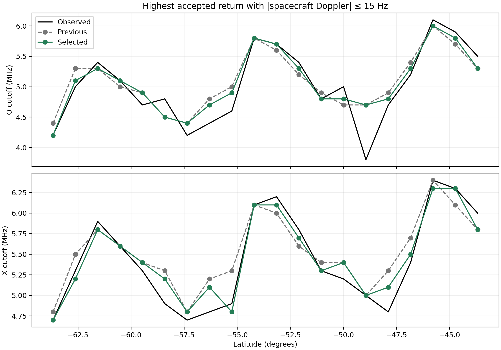
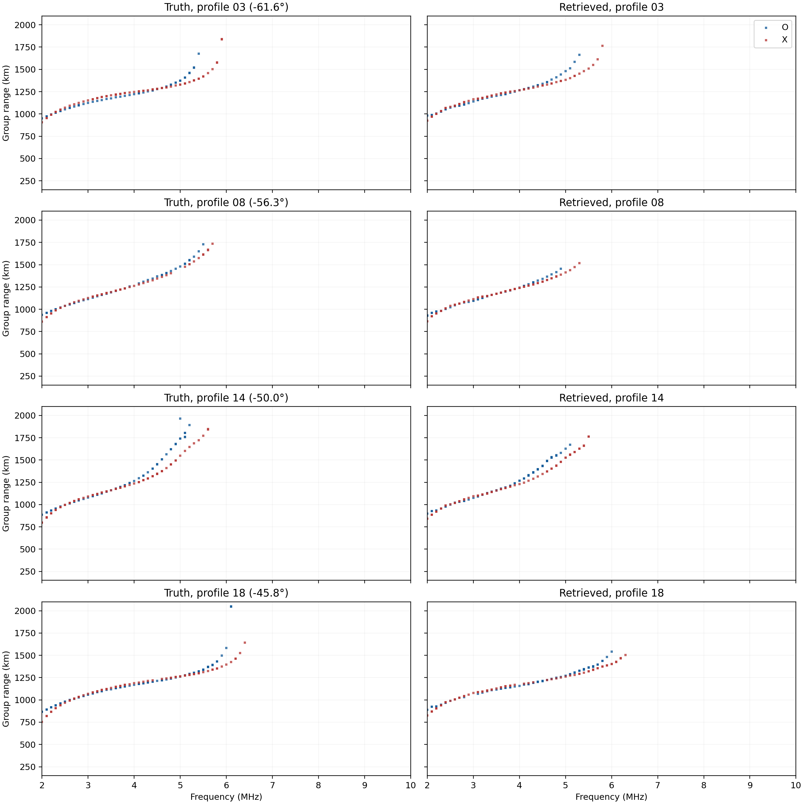
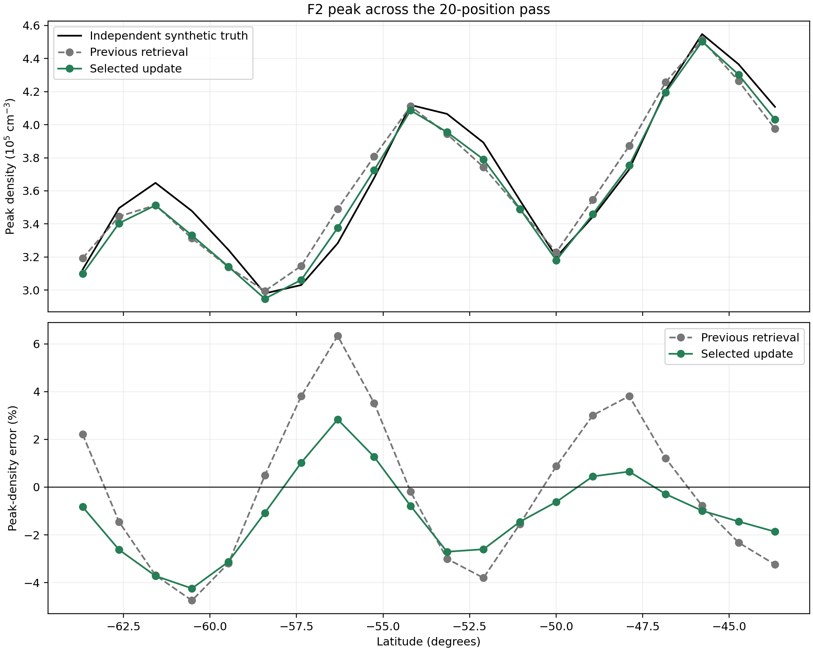
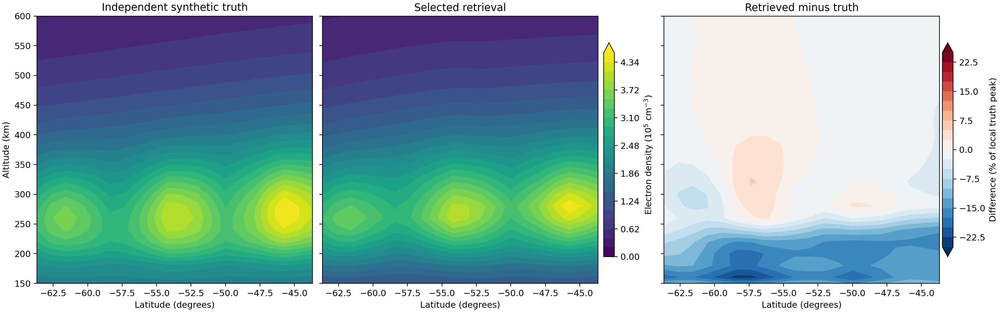

# Low-Doppler joint update for the latitude-wave retrieval

## Summary

Starting from the previous wavy, 20-profile retrieval, a shared latitude correction fitted to low-Doppler O/X returns reduced mean absolute F2 peak-density error from **2.66% to 1.73%**. Absolute peak error fell at **15 of 20** positions; the largest error fell from **6.33% to 4.24%**. The update improved the Doppler-constrained cutoff fit but made the original, unweighted ionogram score and the full-profile density RMS error slightly worse. It is therefore useful as a peak-density retrieval improvement, with a clear observable trade-off.

## Method

The starting field is the [joint round-two](lat_wave_joint_round2_2026-09-28.md) density, which already contains a latitude wave. Two uniform **±5% topside-width** pilots were first raytraced at seven representative positions. Neither improved the ordinary O/X ionogram score: the baseline was 0.2291 versus 0.3038 and 0.2982. The [pilot screen](data/lat_wave_width_round3/pilot_screen.json) records the result. Width response also varied strongly with frequency, so it was not used for the full pass.

The next fit used the highest accepted O- and X-mode frequency at each position **with absolute spacecraft Doppler at most 15 Hz**. For a nominal 8 km/s spacecraft at about 5 MHz, this gate corresponds to returns within roughly 3° of nadir in a simple symmetric geometry. The assumed Doppler resolution is 1 Hz. The observed-minus-modeled gated cutoff was converted to a fractional peak-density proxy and fitted across all **20 positions** with one constant, latitude trend, and cosine/sine pair at the previously fitted **917 km** wavelength. A quarter step limited the grid correction to **−3.7% to +2.3%**, applied with a **65 km Gaussian** around the local F2 peak.

Seven-profile raw forward checks compared 20 km and 65 km vertical envelopes. Because the original raw truth files do not store Doppler, this exploratory screen compared each raw candidate with the same **final observed** ionograms. The broad 65 km candidate lowered the combined ionogram/Doppler score from 0.2567 to 0.2382, while the narrow candidate scored 0.2588. The broad candidate then completed all 20 option-D ionograms at **2–10 MHz in 100 kHz steps**, empty-bin recovery, 20 kHz path continuation, and above-nose probing. Above-nose probes added no returns. Every plotted return was traced at its displayed 100 kHz frequency; all accepted O and X returns are retained.

## Selection from ionograms

The [frozen final selection](data/lat_wave_doppler_peak_round3/final_selection.json) minimizes **0.7 × the established O/X ionogram score + 0.3 × the 15 Hz gated-cutoff score** over all 20 positions. It did not read the truth density during this candidate comparison.

| Metric | Starting retrieval | Broad joint update |
| --- | ---: | ---: |
| Combined selection score ↓ | 0.2326 | **0.2117** |
| O gated-cutoff mean absolute error | 0.235 MHz | **0.165 MHz** |
| X gated-cutoff mean absolute error | 0.185 MHz | **0.110 MHz** |
| Original O/X ionogram score ↓ | **0.2212** | 0.2301 |

The original score worsens by 0.0089. The combined score improves because the mode-resolved, near-nadir cutoff agrees more closely with observation. Rounding every saved Doppler value to **1 Hz** leaves the pooled gated-cutoff error improvement essentially intact: **0.205 to 0.138 MHz**.

The gated cutoffs below show the observed, starting, and updated O/X limits along the pass. This is a filtered observable derived from accepted returns, not an exact local plasma frequency.

The paired ionograms show four positions. Truth is left, retrieval right; O is blue and X red in each panel. Every accepted return is plotted on the 0.1 MHz frequency grid at 1 km range resolution, starting at 150 km. The residual near the profile-14 nose remains visible.

## Density check

After the ionogram selection was saved, the [evaluation](data/lat_wave_doppler_peak_round3/evaluation.json) compared the retrieved grid with the separately generated truth density.

| Metric across 20 positions | Starting retrieval | Broad joint update |
| --- | ---: | ---: |
| Mean absolute F2 peak-density error | 2.662% | **1.730%** |
| Median absolute peak-density error | 3.005% | **1.355%** |
| Largest absolute peak-density error | 6.334% | **4.242%** |
| Mean absolute foF2 error | 0.0717 MHz | **0.0470 MHz** |
| Mean normalized density RMS error, 150–600 km | **6.947%** | 7.029% |

The latitude peak plot shows the largest reduction around the two positive-error crests. The update has less effect on the remaining negative-error trough in the south.

The density section shows the updated wave and residual. The broad correction does not fix the large bottomside mismatch, which a topside sounder cannot strongly constrain from these reflected returns.

## Provenance and limits

The truth electron density is from a separate Fortran IRI-2016 grid with an imposed wave; the retrieval starts from a transformed PyIRI background. The truth and retrieved ionograms share PyLap ray physics. The candidate builder and final selector read observed ionograms but not the truth density grid. **This is still an exploratory result, not a blind validation:** earlier runs had already evaluated density errors on this same case, and the 15 Hz gate and quarter-step size were developed after inspecting that prior evaluation. An unseen wave case is needed to establish whether the 1.73% error generalizes.

The Doppler values here are simulated for an 8 km/s spacecraft in a static ionosphere. Low Doppler favors near-nadir geometry but does not uniquely identify it; off-nadir paths can also have a small projected frequency shift. The 1 Hz check quantizes the simulated values and does not model other measurement noise or plasma motion.

All new ray tracing ran locally. No project files or jobs were created on a server in this pass.
