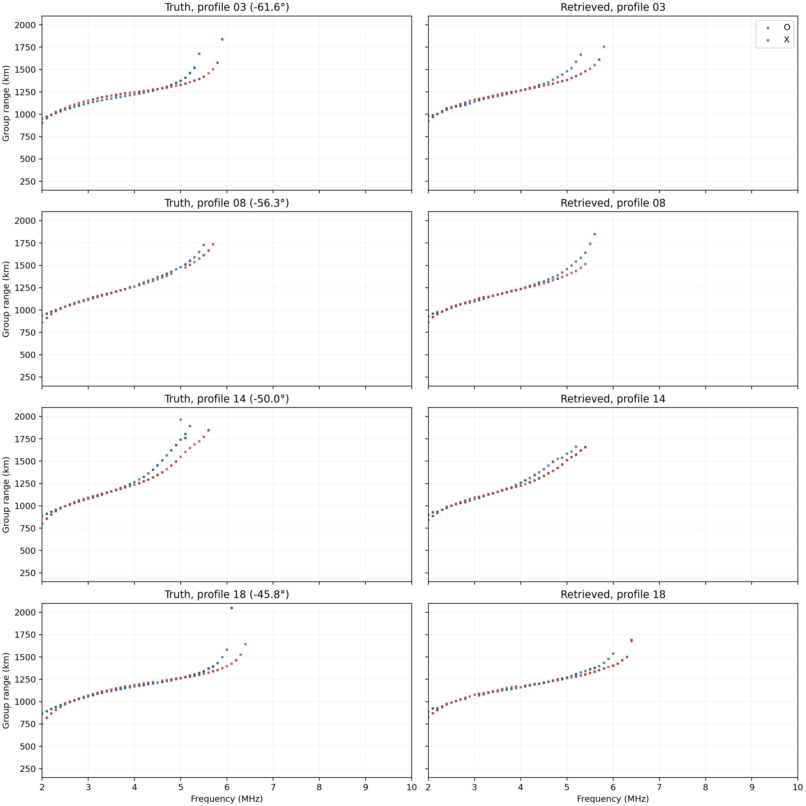
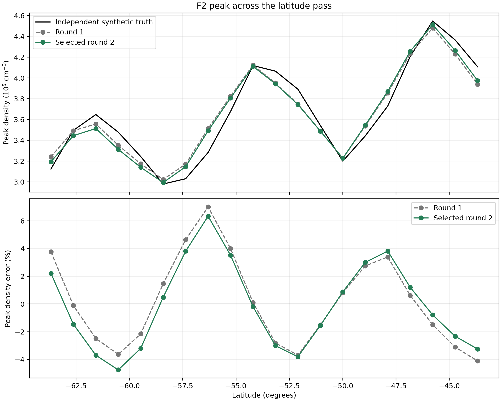
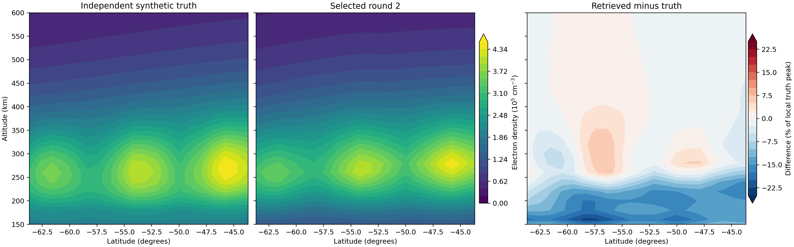

# Joint second round on the latitude-wave retrieval

## Setup and method

This pass starts from the ionogram-selected `smooth_half` retrieval, which already contains a latitude-dependent wave. It fits one shared latitude correction across all 20 O/X ionogram pairs rather than optimizing 20 separate profiles. The shared basis is a linear latitude trend plus sine and cosine at the previously fitted **917 km** wavelength. All candidate grids retain the 2–10 MHz, 100 kHz option-D forward generator, 1 km homing gate, and every accepted return.

Two diagnostics proposed corrections. Centered O/X group-range residuals proposed a peak-height wave of **−6.8 to +8.0 km**. O/X nose residuals proposed a small peak-density correction of **−1.5% to +0.9%** across the positions, applied in a 20 km Gaussian envelope around each local peak. The candidate builder and selector read observed and modeled ionograms and the starting retrieval grid; neither opens the truth density.

Seven representative profiles screened nine candidate strengths. Height-only and combined height/peak candidates were worse than the starting retrieval in this screen. The median accepted-return ridge sometimes jumped between ray branches after a height shift, invalidating the simple range-to-height proxy. Peak-only half and full steps advanced through a complete 20-profile forward pass, empty-bin recovery, 20 kHz continuation, and above-nose probes. The plotted and scored returns are all rays traced at their displayed 100 kHz frequencies. Above-nose probes added no returns in either finalist.

## Ionogram-only selection

The [frozen selection](data/lat_wave_joint_round2/final_selection.json) compares all 20 final O/X ionograms before reading the truth density.

| Candidate | Mean ionogram score ↓ | O nose MAE | X nose MAE |
| --- | ---: | ---: | ---: |
| Starting wavy retrieval | 0.22282 | 0.170 MHz | 0.165 MHz |
| Peak half step | 0.22587 | 0.160 MHz | 0.195 MHz |
| Peak full step, selected | **0.22119** | **0.165 MHz** | **0.165 MHz** |

The selected score improves by **0.00163** (0.7%). It is lower at 10 of 20 positions. The standard deviation of paired position score changes is 0.0329; a position bootstrap gives a 95% interval of **−0.0161 to +0.0122** for selected minus starting mean score. Thus the improvement is small relative to variation along the pass.

The [paired ionograms](figures/lat_wave_joint_round2_ionograms.png) show truth at left and selected retrieval at right for four latitudes. O is blue and X is red in each panel. Every accepted return is plotted on the 0.1 MHz frequency grid and at 1 km range resolution; range begins at 150 km. The near-nose disagreement at profile 14 remains visible.

## Post-selection density check

Only after the final selection file was written did the [evaluation](data/lat_wave_joint_round2/evaluation.json) open the separately generated truth density.

| Metric across 20 positions | Starting retrieval | Selected joint round |
| --- | ---: | ---: |
| Mean absolute F2 peak-density error | 2.682% | **2.662%** |
| Mean absolute foF2 error | 0.0720 MHz | **0.0717 MHz** |
| Mean normalized density RMS error, 150–600 km | **6.9405%** | 6.9467% |

Peak-density absolute error falls at **8 of 20** positions. The mean reduction is only **0.020 percentage points**, and the full-profile RMS error rises slightly. This is a measured, but not compelling, accuracy gain. The [peak plot](figures/lat_wave_joint_round2_peaks.png) shows that the smooth correction helps one end of the pass and worsens part of the first trough.

The [density section](figures/lat_wave_joint_round2_density.png) shows the retrieved wave and its residual after selection. The dominant remaining errors vary with latitude more strongly than this small nose-derived update can resolve.

## Provenance and limits

The synthetic truth density came from a separate Fortran IRI-2016 grid with an imposed wave; the retrieval starts from a transformed PyIRI background. Truth and candidate ionograms share PyLap ray physics. The density comparison is withheld from this round's candidate generation and ionogram selection, but earlier work had already calibrated the prior on an IRI ionogram and evaluated the first-round retrieval on this wave case. This is an exploratory test, not a fully blind validation. All new ray tracing in this round ran locally; no server files or jobs were created.

The next useful change is to model ray-branch association and topside shape across latitude. A simple median ridge height correction failed its forward check, and the 100 kHz nose residuals supported only a weak additional peak correction.
