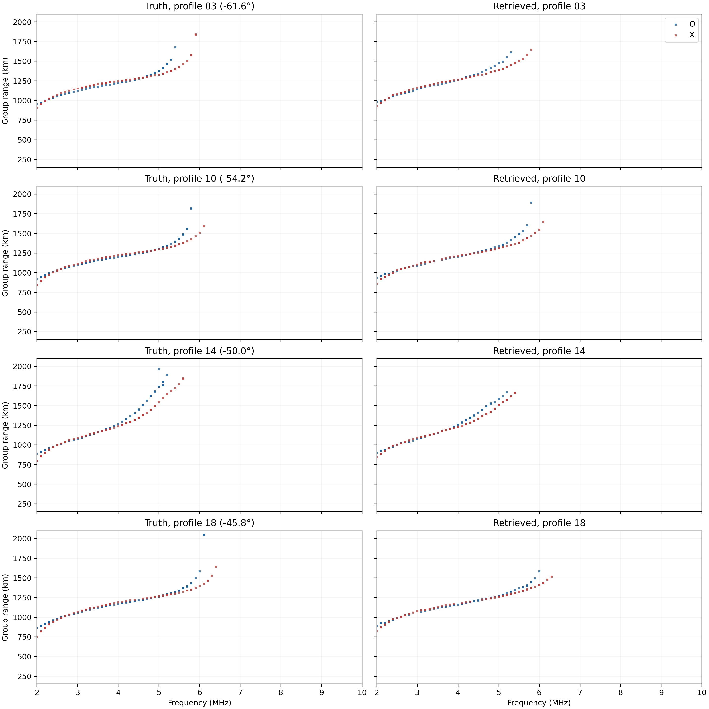
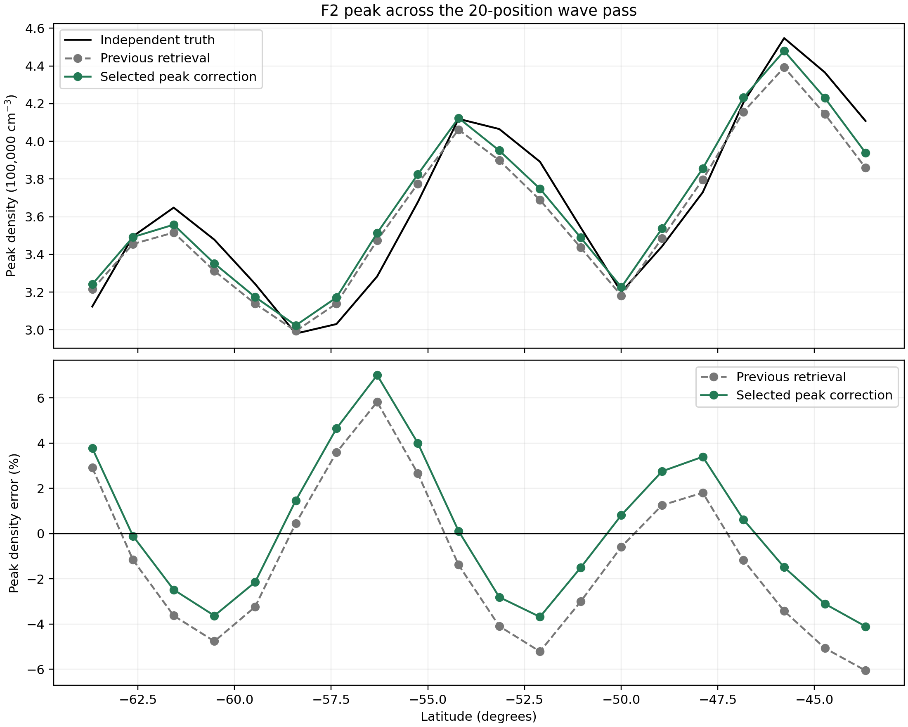
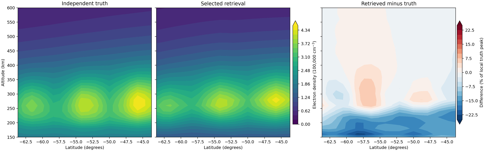

# F2 peak refinement across the latitude-wave pass

## Method

The previous 20-position retrieval already included the 3.0646% F2-peak
correction, with a 20 km Gaussian width, that was calibrated in the earlier
single-profile case. I tested *additional* 20 km corrections across this pass.
Their latitude dependence was fitted from the observed-minus-modeled O- and
X-mode ionogram noses. The correction fit and candidate selection did not read
the truth electron-density grid.

Four candidate forward grids were traced with the option D fan on the complete
2–10 MHz, 100 kHz sweep: uniform extra 3%, and half, full, or 1.5 times the
smooth nose-derived correction. At the 20 sounder positions, the smooth-half
candidate adds **0.84–2.13%** at the local F2 peak. The two strongest raw
candidates received empty-bin recovery, 20 kHz
path continuation, and above-nose probes; saved ionogram points remain rays
traced at the plotted 100 kHz frequencies. No above-nose probe added a return
to either finalist.

## Ionogram selection

The [saved final selection](data/lat_wave_peak_candidates/final_selection.json)
uses all 20 observed O/X ionograms, without truth density:

| Candidate | Mean ionogram score | O nose MAE | X nose MAE |
| --- | ---: | ---: | ---: |
| Previous retrieval | 0.2310 | 0.190 MHz | 0.190 MHz |
| Extra uniform 3% | 0.2235 | 0.170 MHz | 0.180 MHz |
| Smooth-half correction, selected | **0.2228** | **0.170 MHz** | **0.165 MHz** |

The other two smooth candidates had worse raw scores and were not carried
through the final continuation. The uniform and smooth-half final scores differ
by only **0.0007**. Their position-by-position score differences have a 0.025
standard deviation, so this choice is sensitive to the scoring rule and
forward-tracer variability.

The [paired ionograms](figures/lat_wave_peak_refinement_ionograms.png) show
four representative latitudes. Truth is on the left, retrieval on the right.
Blue is O mode and red is X mode in each panel. Every accepted return is
plotted at 0.1 MHz by 1 km resolution, with the group-range axis starting at
150 km. The correction improves the mean ionogram score, while near-nose group
ranges still disagree, particularly at profile 14.

## Density check after selection

Only after choosing smooth-half did the evaluation read the withheld truth
density. The [saved evaluation](data/lat_wave_peak_candidates/evaluation.json)
gives:

| Metric across 20 profiles | Previous | Smooth-half |
| --- | ---: | ---: |
| Mean absolute F2 peak-density error | 3.06% | **2.68%** |
| Mean absolute foF2 error | 0.084 MHz | **0.072 MHz** |
| Mean normalized density RMS error, 150–600 km | 6.98% | **6.94%** |

Peak error decreased at **12 of 20** positions. The largest remaining absolute
peak error is **7.00%**. Post-selection checks of the other candidate densities
gave 3.03% for uniform, 2.75% for smooth-full, and 3.22% for smooth-strong;
those truth-density numbers played no part in selection.

The [peak plot](figures/lat_wave_peak_refinement_peaks.png) shows why the
single-profile correction did not yield sub-1% accuracy across this pass:
the previous peak error changes sign with latitude. An added positive peak
correction helps some positions and worsens others. The selected correction
reduces average error but leaves an error as high as +7.00%.

The [latitude-altitude density plot](figures/lat_wave_peak_refinement_density.png)
shows the retrieved wave and its residual. The narrow peak correction barely
changes the remaining bottomside-shape mismatch: normalized RMS error over
150–240 km is **14.26%** of the local truth peak. Further work should fit the
latitude-dependent peak and bottomside profile shape.

## Provenance and limits

The truth density was generated separately from Fortran IRI-2016 with an
imposed wave. The retrieval is a transformed PyIRI background. Both ionogram
sets use the same PyLap ray physics. The fitting and selection scripts read
observed ionograms but not the truth density; the evaluation script opens that
grid only after the final selection file exists. The PyIRI prior was calibrated
on an earlier IRI ionogram, and the previous wave fit had been evaluated
against this wave truth in earlier work. This remains an exploratory numerical
test, not a fully blind validation.

All four Cartman forward batches produced 20 valid outputs, and the uniform
candidate's 20 recovery jobs also completed. Recursive owner/permission checks
found no privacy violations; project directories and staged scripts were
verified owner-only after the jobs. [Run status](data/lat_wave_peak_candidates/remote_run_status.json)
and the [local/server cross-check](data/lat_wave_peak_candidates/local_remote_crosscheck.json)
record the details. The final two continuations ran locally with the same
option D generator and candidate grids. Two of four local/server spot checks
had identical frequency/mode return counts; the other two differed in one or
two bins. The four simultaneous Cartman batches took 1,323–2,412 seconds,
while the corresponding local spot checks took 51–62 seconds each. These
server batch times are not representative of local single-ionogram runtime.
