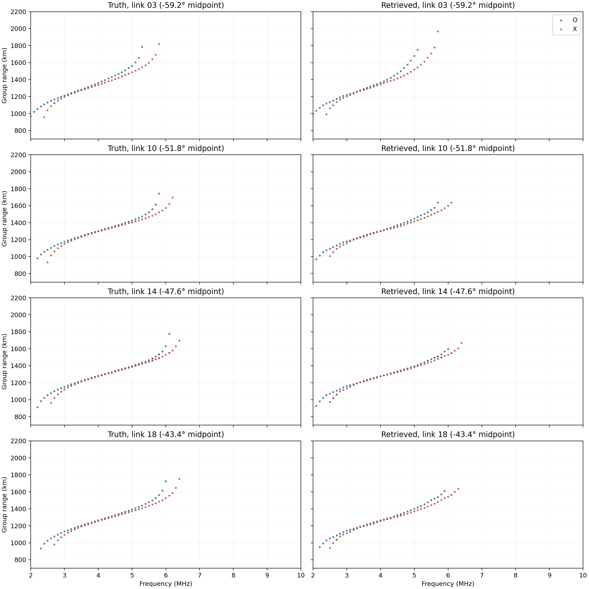
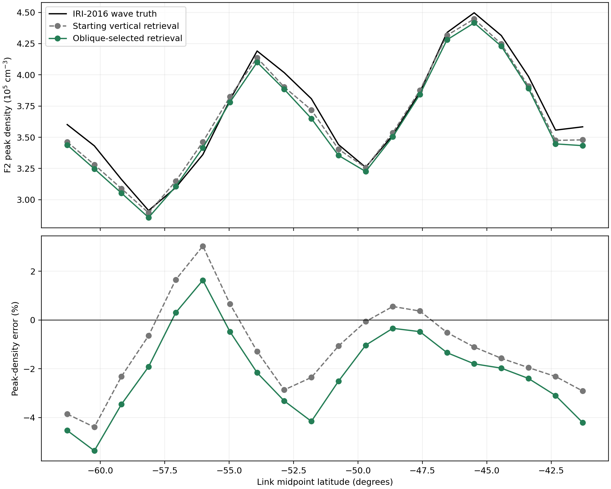
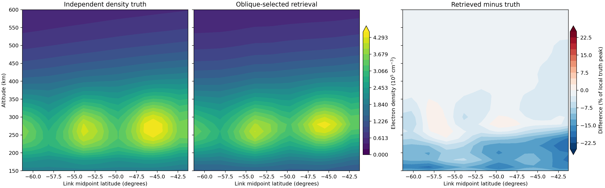

# Two-satellite oblique retrieval of the latitude wave

## Setup

Twenty northbound links use the saved 20° latitude wave case. Both spacecraft are at 800 km altitude, with **600 km physical along-track separation** and a nominal northward speed of 8 km/s. The frozen ionosphere is traced in O and X modes from 2 to 10 MHz at 0.1 MHz spacing. The receiver homing gate is 1 km. A path must descend at least 100 km below the spacecraft before it can count as an ionospheric return; direct satellite-to-satellite rays are excluded. All 1569 accepted O/X returns are saved. Their launch elevations span -81.6° to -31.3° and their modeled spacecraft Doppler spans **-39.7 to 123.8 Hz**.

## Retrieval

The starting density is the previous vertical-ionogram retrieval. Smooth latitude corrections were estimated from oblique O/X cutoff differences and 2.5–4.5 MHz group-range residuals. The latter propose a local reflector-height shift. [A six-link screen](data/oblique_wave_600km/pilot_selection.json) compared six updates using the O/X ionogram score alone; its two best candidates were then forward-traced across all 20 links. [The frozen full-pass selection](data/oblique_wave_600km/selection.json) chose **gain0_sigma100_height1_spline** using 80% O/X ionogram score and 20% Doppler score after 1 Hz quantization. Truth density was not read during either selection.

The selected update shifts local profiles by -11.4 to +5.6 km. It applies no additional peak-density scaling.

| Mean score across 20 links (lower is better) | Starting | Selected |
| --- | ---: | ---: |
| O/X ionogram | 0.1958 | 0.1838 |
| 1 Hz Doppler | 0.2374 | 0.1976 |
| Combined | 0.2041 | 0.1866 |

The ionogram score weights symmetric accepted-return distance (55%), mode-resolved return cutoff (25%), and common-frequency median group-range residual (20%).

The next figure shows four truth/retrieved pairs. O is blue, X red; all accepted paths are shown at their traced 0.1 MHz frequencies and rounded to 1 km group-range bins.

## Density check after selection

| Peak-density error across 20 positions | Starting | Selected |
| --- | ---: | ---: |
| Link midpoints, mean absolute | 1.77% | 2.33% |
| Transmitter positions, mean absolute | 1.73% | 2.17% |
| Link midpoints, 150–600 km normalized profile RMS | 7.34% | 6.21% |

The selected oblique update improves the overall density profile but increases F2 peak-density error. The almost tied **gain0.25_sigma100_height1_spline** update scored 0.1880 on the observables. Its post-selection midpoint peak error was 1.82% and its profile RMS error was 5.92%. These truth-density numbers were not used to choose the retrieval.

## Provenance and limits

The electron-density truth is a separate Fortran IRI-2016 grid with an imposed 900 km latitude wave. The starting retrieval is a transformed PyIRI field. Truth and modeled ionograms share the PyLap ray tracer and homing procedure. The [evaluation record](data/oblique_wave_600km/evaluation.json) was generated after selection. This is an exploratory augmentation of a vertical retrieval that had already been developed on this wave case, so it is not a blind validation. Doppler uses each satellite's local tangent velocity through a static ionosphere. Returns are matched by mode, frequency, and nearest group range within 40 km; unmatched returns incur the maximum Doppler cost, and a 20 Hz difference reaches that maximum. The 1 Hz check is quantization, not a measured noise model.
