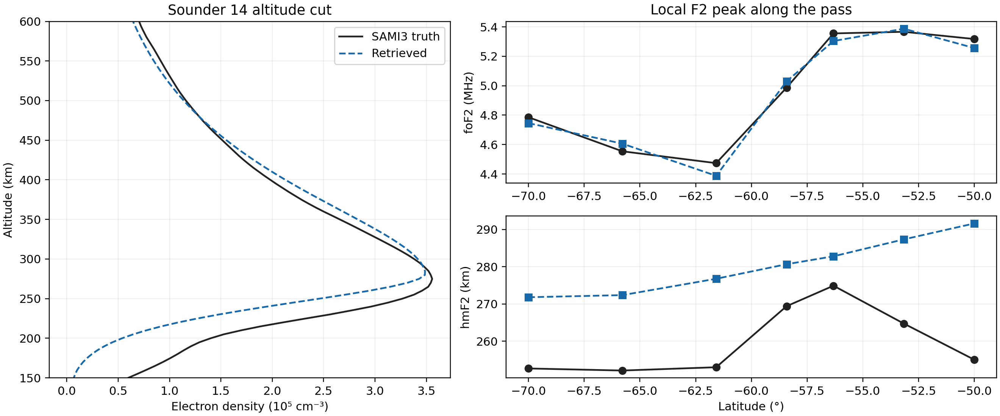
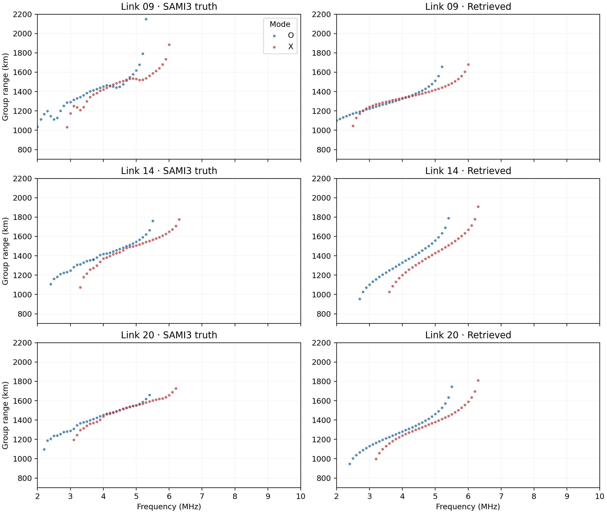
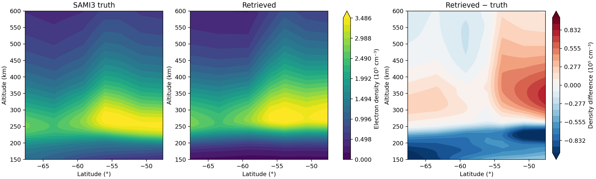
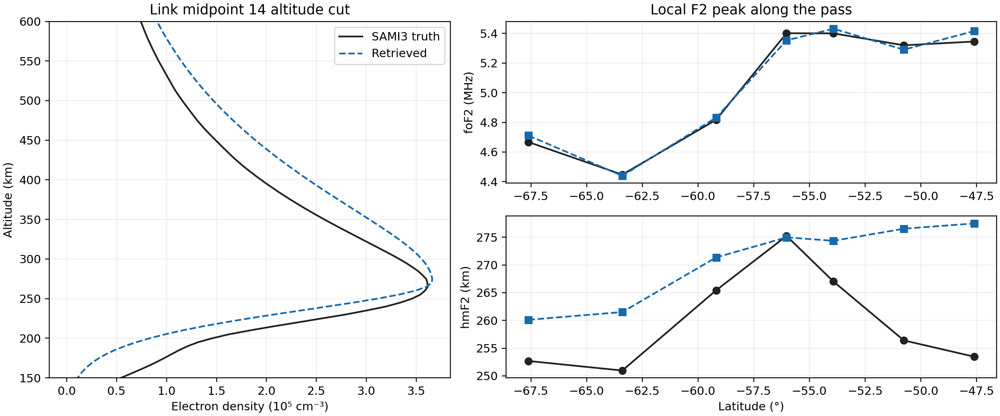
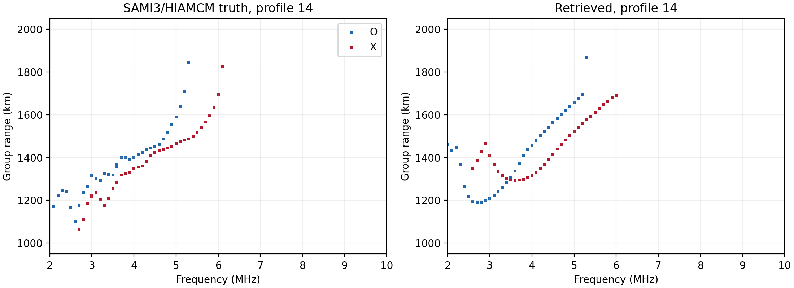
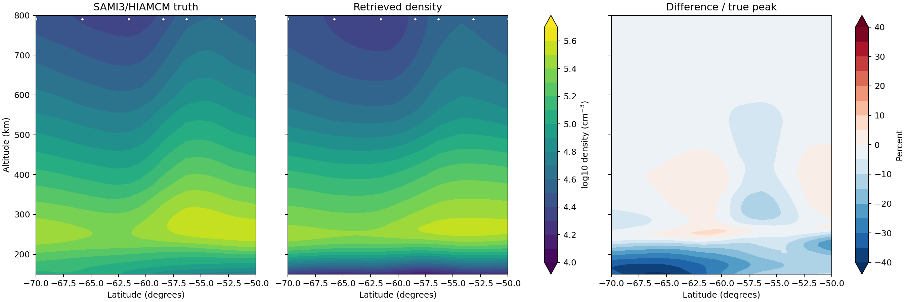
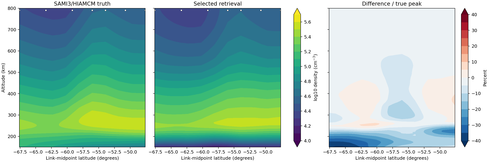
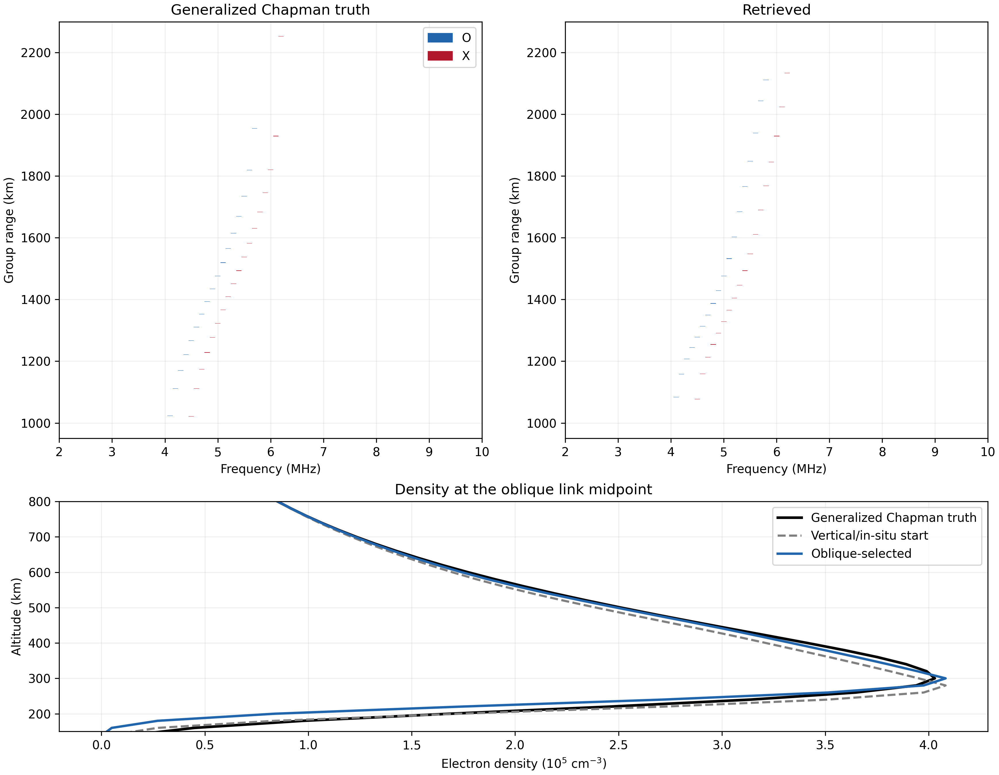

## Summary

We tested a frozen **11 January 2017, 06:00 UTC** SAMI3/HIAMCM density snapshot at **190°E**, from **70°S to 50°S**. Seven positions sample a natural F2 trough and crest. PyIRI starts the inversion; SAMI3 supplies an independent electron-density truth. Both simulations use the same ray tracer, 800 km spacecraft altitude, O and X modes, and **2–10 MHz in 0.1 MHz steps**.

The current retrieval lets F2 height and topside shape vary along latitude, enforces a monotonically falling topside, and uses synthetic in-situ density every 1 km along the spacecraft track. We transferred the vertical fit to 600 km two-satellite links, then extended its in-situ anchor across both spacecraft tracks. The selected oblique field improved the earlier oblique ionogram score from **113.3 to 74.2 equivalent km**, but a visible low-frequency branch-shape mismatch remains. This transfer test has **not** optimized its topside shape against oblique residuals.

| Current selected field; seven observed locations | Vertical sounders | Oblique link midpoints |
|:--|--:|--:|
| Peak-density MAE | 2.22% | 2.20% |
| foF2 MAE | 0.054 MHz | 0.055 MHz |
| hmF2 MAE | 4.29 km | 7.86 km |
| Density NRMSE, 150–800 km | 8.42% | 8.27% |
| Topside NRMSE, 350–800 km | 2.96% | 2.99% |

The vertical sounders and oblique link midpoints occupy different latitudes; these columns are separate evaluations, not an accuracy ranking of the geometries. FoF2 and hmF2 come from density profiles, not ionogram noses. Sections 2–4 document the earlier, less flexible inversion for context. Section 5 gives the current SAMI method, paired ionograms, density cuts, and low-frequency diagnosis. Section 6 tests an oblique shape search against NeQuick-G, Chapman, and IRI-2016 density generators. The IRI test improves the ionogram score but worsens the true topside density error; the two results must be considered together.

\clearpage

## 1. Truth, prior, and what is independent

The saved MATLAB snapshot `2017-01-11_0600.mat` contains the `dene` electron-density field and a prepared ray-tracing density grid. Its time value converts to **11 January 2017, 06:00 UTC**. We checked that those densities agree over the regional grid after longitude reordering; the source SHA-256 is recorded in the case manifest. The repository's `remap_sami.m` identifies this snapshot path as the HIAMCM version of the SAMI3 output. Its original source NetCDF is unavailable here, so that upstream label cannot be independently rechecked from the original file. We interpolated density onto a **5 km altitude grid from 80 to 820 km** and traced rays through a regional latitude–longitude grid. The latitudinal wave and trough are present in the snapshot; they were not imposed for this experiment.

PyIRI supplied the independent **starting electron density** at the same epoch, with F10.7 = 75 and daily Ap = 5. The truth grid retains PyIRI's magnetic, neutral, and thermal supporting fields while replacing its electron density with SAMI3. Truth and retrieval ionograms therefore share the PyLap propagation and homing physics; this is an independent **density-model** comparison, not independent ray-physics or instrument validation. The wave location was selected after inspecting the SAMI3 density, so this is an exploratory case rather than a blind random sample.

The seven tested transmitter latitudes correspond to positions **1, 5, 9, 12, 14, 17, and 20** of a 20-position pass. Every plotted ionogram displays **all accepted reflected returns** at the exact traced 100 kHz frequencies, with group ranges rounded to **1 km** for display. Blue is O mode and red is X mode. A receiver miss of at most **1 km** is accepted; homing gaps can therefore affect the last-return frequency, especially near the nose.

## 2. Vertical inversion

At each of the seven positions we measured the last accepted O and X return frequencies in the SAMI3 and PyIRI ionograms. Their squared frequency ratios proposed a local peak-density multiplier. A shape-preserving cubic interpolation made one smooth latitude field from those seven multipliers. The median low-frequency O-mode group-range residual proposed a topside stretch about each prior F2 peak. We forward-traced the prior and a peak-plus-topside candidate with the full three-dimensional O/X ray generator. A second peak correction, confined by a **60 km Gaussian** around the current local peak, used the remaining O/X nose residuals and received another full forward check. Candidate selection used only these ionograms.

The ray generator used the option-D equal-area guarded vertical fan. It recovered empty frequency/mode bins with extra seeds and used 20 kHz intermediate frequencies near the nose for continuation; each **saved** return was traced again at its displayed 100 kHz grid frequency. The score averaged a symmetric nearest-return distance, O/X last-return-frequency error, and common-frequency median group-range error with weights **0.55, 0.25, and 0.20**. The full-set minimum selected `peak_round2`: score **0.5837**, versus **0.7348** for PyIRI. The fitted first-stage peak multipliers span **0.857–1.060**; the selected full topside proposal spans **1.315–2.299**. The second local peak factors span **0.923–1.031**.

\clearpage

### Vertical O/X ionograms

{width=96%}

The retrieval follows the **frequency cutoff** better than the **range ridge**. At sounder 14, truth has accepted low-frequency O and X returns at substantially longer group ranges than the selected model. At sounder 20 the modes overlap well around 4–5 MHz, then separate in range toward lower frequencies. These differences are not a plotting artifact: both panels display every saved accepted return under the same homing gate.

\clearpage

### Vertical density and F2 peak

{width=100%}

{width=96%}

The selected vertical field has **0.051 MHz foF2 MAE** and **2.07% peak-density MAE**, but its **20.2 km hmF2 MAE** is essentially no better than PyIRI's 19.9 km. Its 150–600 km normalized density RMS remains **16.2%**. The paired ionograms reveal why the peak result alone is insufficient: the truth group range at lower frequencies can be over 100 km longer than the modeled return.

\clearpage

## 3. Two-satellite oblique inversion

For each tested position, the transmitter and receiver are both at **800 km**, with a **600 km straight-line separation** along the latitude track. We traced O and X modes from the same 2–10 MHz grid. The starting oblique density is exactly the selected vertical grid above. The saved oblique observables keep reflected rays with group range at least **700 km** whose paths descend at least **100 km** below spacecraft altitude. This filter removes the roughly 600 km quasi-direct path; it cannot appear in either plotted oblique ionogram.

The seven pairs of truth and starting-field oblique ionograms supplied two proposals. O/X last-return-frequency residuals suggested a local peak correction through $\Delta N/N\simeq2\Delta f/f$. Median group-range residuals over **2.5–4.5 MHz** suggested a reflector-height shift through $\Delta h\simeq-\Delta R/1.7$. A regularized constant, latitude trend, sine, and cosine basis at a **fixed 1300 km** wavelength smoothed the peak proposal; a cubic spline smoothed the height proposal. We tested a height-only candidate and one with the same height shift plus peak correction. Their allowed peak change was at most about **3%**, and their downward altitude shift ranged **8–20 km**. These are conservative steps from the vertical solution: the raw range residuals imply a much larger displacement, outside the pre-set **25 km** height trust region.

Each candidate was forward-traced on all seven links. Selection minimized **0.8 times the O/X ionogram score plus 0.2 times a Doppler score**. We assumed spacecraft speed **8 km/s** and rounded simulated Doppler to **1 Hz**. An observed return is paired to the nearest modeled return of the same mode and frequency when their ranges differ by at most **40 km**; its rounded Doppler difference is scaled by **20 Hz** and capped at one. Unmatched rays cost one. This score can saturate when paths or group ranges differ substantially, so its value is reported separately. The selected candidate is **`gain1_sigma60_height0.15_spline`**.

\clearpage

### Oblique O/X ionograms

{width=96%}

The downward height correction moves the modeled oblique ridge closer to truth, but links 9 and 20 still have low-frequency range deficits and incomplete near-nose agreement. These are the reflected branches used in the inversion. A quasi-direct trace would begin near 600 km and would require a separate forward simulation and score; adding a line to this plot would not recover an excluded ray.

\clearpage

### Oblique density and F2 peak

{width=100%}

{width=96%}

The selected oblique candidate changes the seven-link mean O/X score from **0.6374** to **0.5886** and its 1 Hz Doppler score from **0.9657** to **0.9620**. Doppler pairing remains almost fully penalized, so that number is weak evidence about angle recovery. The combined score is **0.6633**, only **0.0018** below the height-only candidate's score. In the independent density evaluation, midpoint RMS falls from **17.34%** to **12.11%**, foF2 MAE from **0.041** to **0.035 MHz**, peak-density MAE from **1.60%** to **1.36%**, and hmF2 MAE from **23.1** to **10.8 km**. The remaining hmF2 bias is **+10.7 km**, and the lower profile and parts of the ionogram ridge remain visibly wrong.

\clearpage

## 4. Interpretation and limits

The height-only candidate was almost tied with the selected height-plus-peak candidate on the observable score (**0.6650** versus **0.6633**). Its independent midpoint density RMS was **12.15%**, foF2 MAE **0.042 MHz**, and hmF2 MAE **10.8 km**. Adding the small peak correction improved foF2 and peak-density accuracy, while the height result barely changed. The apparent advantage is modest compared with the large remaining ionogram ridge mismatch.

The SAMI3 bottomside structure and latitude-dependent peak height challenge this low-dimensional correction. Vertical sounding recovers F2 peak frequency much better than the full altitude profile. Oblique links add a second viewing geometry, but inherit the vertical field and sample only seven midpoints. Large range residuals, receiver-homing gaps, and saturated Doppler pairings limit the current score's ability to constrain the lower profile.

Candidate generation and the stated selection scores use saved truth **ionograms**, modeled ionograms, and the candidate grids. The SAMI3 truth **density** is used for the displayed errors and contour cuts. A baseline diagnostic render loaded that truth grid before the final oblique score selection, but it was neither inspected nor used to change the two predeclared oblique candidates or the selection rule. The earlier choice of this wave-rich location from the truth density and the common ray physics remain the principal limits on claims of independent validation.

### Reproducibility record

The [case manifest](data/sami3_wave_20170111_0600/manifest.json) records the epoch, positions, sweep, homing gate, and source checksum. The [vertical selection](data/sami3_wave_20170111_0600/vertical_selection.json) and [density evaluation](data/sami3_wave_20170111_0600/vertical_evaluation.json), plus the [oblique selection](data/sami3_wave_20170111_0600/oblique_wave_600km/pilot_selection.json) and [selected density evaluation](data/sami3_wave_20170111_0600/oblique_evaluation_gain1_sigma60_height0.15_spline.json), hold the exact reported values. `plot_sami3_wave_results.py` regenerates the paired ionograms, density sections, altitude cuts, and peak curves from saved outputs. Full-grid rays ran in `chartat1`'s private Cartman area; the 16 GB laptop was used only for lightweight scoring, plotting, and PDF generation.

\clearpage

## 5. Spatially varying monotone topside: current tests

The earlier field had too little flexibility to reproduce the SAMI topside over the pass. The current field starts from an ionogram-derived `nose_init` PyIRI grid and gives each of seven sounding latitudes its own F2 height shift and two topside log-density shape fractions. Those fractions specify density at **25%** and **60%** of the distance from the local peak to the 800 km spacecraft. Shape-preserving interpolation carries the parameters across latitude and joins each profile through the peak, both shape points, and the measured 800 km density. The knot values descend strictly above the peak. Every grid column is checked for an upward density step; the selected field has **zero**.

The vertical candidate set was proposed from O/X ionogram ridge residuals and selected by the lowest **uncapped** symmetric group-range score over all seven truth ionograms. The score uses every accepted O and X return at each occupied 100 kHz frequency, a 150 km cost when only one side has a return, and 100 km per MHz of mean O/X nose discrepancy. The selected vertical field scores **78.7 equivalent km**. At the seven observed positions it has **2.22% peak-density MAE**, **4.29 km hmF2 MAE**, and **2.96% topside NRMSE** from 350 to 800 km. Its 800 km fit misses the 2,225 synthetic 1 km track samples by at most **0.016%**.

The in-situ samples were drawn from the SAMI model to represent an observable; they are not an independent measured data set. Candidate construction and selection did not read the full three-dimensional SAMI truth field. Previous inspection of this case influenced the method, so the test is not blind. The SAMI electron density remains independent of the PyIRI starting density, while the magnetic, collision, and ray-physics inputs are shared.

{width=94%}

\clearpage

{width=100%}

### Two-satellite transfer and full-track anchor

For each oblique link, both spacecraft are at 800 km and separated by **600 km** along track. The generator uses the same 75-direction fan and 1 km homing gate in truth and candidate runs. It retains **reflected** O/X returns only; the quasi-direct path is excluded. We traced the frozen vertical field without altering its shape, then rebuilt the same shape while honoring **2,759** synthetic 800 km samples at 1 km spacing across both transmitter and receiver tracks. The full-track anchor is required because the receiver extends north of the original vertical pass. The transferred field misses those samples by up to **1.62%**; the extended field misses by at most **0.283%**. The assumed in-situ tolerance is **0.5%**.

Both candidates were traced on all seven links. The choice was frozen using only O/X ionograms and the synthetic in-situ observations: reject any field outside the 0.5% track tolerance, then minimize the ionogram score. Doppler at **8 km/s** spacecraft speed and **1 Hz** quantization is reported as a separate diagnostic. The full three-dimensional SAMI density was opened only after this choice. The extended-anchor field was selected; **oblique group-range residuals did not yet adjust its topside shape**.

| Seven-link result | Earlier oblique fit | Vertical field transferred | Selected full-track anchor |
|:--|--:|--:|--:|
| Uncapped O/X score, equivalent km ↓ | 113.3 | **72.3** | 74.2 |
| 1 Hz Doppler mismatch ↓ | 0.962 | 0.754 | **0.750** |
| Maximum 800 km in-situ error | 54.73% | 1.62% | **0.283%** |

The selected field lowers the ionogram score **35%** relative to the earlier oblique fit. The slightly lower score of the direct vertical transfer does not make it eligible under the stated in-situ tolerance. Link 12 remains slightly worse than the earlier oblique fit on ionogram score. The Doppler metric caps an unmatched or greater-than-20 Hz error at one, so its numerical improvement is useful but does not imply correct ray angles.

\clearpage

{width=98%}

At link 14, the retrieved **2.5 MHz O** ray turns at **571 km** rather than the truth's **637 km** and has **161 km** excess group range. The retrieved **3.5 MHz X** ray turns at **545 km** rather than **602 km** and has **132 km** excess group range. The accepted 2.5–4.5 MHz rays have receiver miss distances below **415 m** in truth and **103 m** in the selected fit, safely inside the 1 km gate. This points to a field or ray-path mismatch rather than a loose homing tolerance. Group range alone is ambiguous: the 3 MHz O ranges are nearly equal despite a 35 km turning-height difference. The modeled Doppler also has a different sign over part of this branch, offering an angle constraint for the next fit.

\clearpage

{width=100%}

At the seven observed link midpoints, the selected field's **topside NRMSE is 2.99%**, versus **5.82%** for the earlier oblique fit. Its **hmF2 MAE is 7.86 km** versus **10.0 km**. Peak-density MAE worsens from **1.37% to 2.20%**; foF2 MAE worsens from **0.035 to 0.055 MHz**. Across all twenty link midpoints, the selected field has **2.83% topside NRMSE**, **6.0 km hmF2 MAE**, and **2.41% peak-density MAE**. These density diagnostics were computed after the ionogram/in-situ choice was frozen.

The low-frequency mismatch is consistent with a specific upper-topside deficiency. Along link 14, the selected field is approximately **10–27% below SAMI density between 500 and 700 km**, depending on altitude and position, while matching the 800 km samples. A monotone profile can still have the wrong curvature between its peak and the measured spacecraft point. The mismatch varies along the 600 km link, so a single shared shape would be inadequate.

The low-frequency discrepancy motivates an oblique-specific fit of the two topside shape fractions. Section 6 tests that idea with separate density generators. A third independently adjustable point near **650–700 km** may still be needed if the two-point shape cannot fit the low-frequency bend without spoiling the mid-frequency ridge.

The [current vertical record](data/sami3_monotone_topside/README.md), [oblique record](data/sami3_monotone_oblique/README.md), [oblique selection](data/sami3_monotone_oblique/selection.json), and [post-selection density evaluation](data/sami3_monotone_oblique/evaluation.json) provide the exact inputs and errors. The fourteen new oblique traces ran in private `chartat1` Cartman jobs, with at most two active; their largest measured resident set was **19,920,496 kB**. No SAMI rays ran on the 16 GB laptop.

\clearpage

## 6. Oblique shape fit against three independent density generators

We held out three density profiles generated outside the retrieval model: a public **NeQuick-G** profile, an **analytic generalized Chapman** profile, and a spatially varying **Fortran IRI-2016** field. The NeQuick-G source profile was generated for **62°S, 8°W, April at 13 UT** and replicated onto this link's ray grid; the Chapman truth has a **300 km F2 peak** and unequal bottomside and topside scales. These two cases test profile shape without horizontal density changes, not geographic realism. IRI-2016 keeps its native horizontal variation. Each case uses two spacecraft at **800 km** with **600 km** separation, O and X reflected returns at **2–10 MHz in 0.1 MHz steps**, a **1 km receiver-homing gate**, and synthetic electron-density samples every **1 km** along the link. The quasi-direct path is excluded by the reflected-return filter.

The NeQuick-G values came from the public [tpl2go implementation](https://github.com/tpl2go/NequickG) at commit `1d178341`, converted from Python 2 without model-equation changes. Chapman values came from the separately coded analytic expression with foF2 **5.7 MHz**, bottomside scale **70 km**, and topside scale **95 km**. The IRI field came from public Fortran IRI-2016 **1.11.1** at **2010-01-01 12 UT**. The candidate builder uses none of those generators or their density parameters.

The density *start* is a model-agnostic monotone spline fitted to a saved vertical **O-mode ionogram** for that case. We then make its 800 km densities follow the in-situ samples. This is a stronger starting observation set than an oblique ionogram alone. A separate PyIRI grid supplies common magnetic and collision fields; its density profile at **68°S, 12°W and F10.7 = 120** is saved as a different-condition prior reference, but it is **not** the density traced as the start. The IRI-2016 truth has approximately **F10.7 = 72.7** near **53.68°S, 7.74°E**. Thus the IRI test does not begin from the same location or solar-condition IRI density, while the actual start is based on the observed vertical ionogram rather than directly on the PyIRI density prior.

We parameterize the topside by log-density fractions at **25%** and **60%** of the height interval from F2 peak to spacecraft, and by an F2-height shift. A shape-preserving cubic interpolation joins the peak, two fractions, and measured 800 km density. Its knots and every generated profile are constrained to decrease above F2. The first oblique search tested each fraction in both directions and a positive and negative **10 km** height shift. After inspecting only these O/X and Doppler scores, a second bounded search tested a combined shape/height change and a larger step in each uniform-profile case. For IRI it tested a combined change, a larger upper-shape change, and upper-shape gradients of both signs across the link. Each candidate was fully ray-traced; no density-model family is fitted as a basis. The selected IRI field varies its upper-shape fraction from **0.152** to **0.232** between spacecraft.

Selection uses the uncapped symmetric O/X group-range residual, a **150 km** missing-frequency cost, **100 km/MHz** mean nose cost, and **20 equivalent km** times the 1 Hz quantized Doppler mismatch. The latter pairs returns within 40 km, divides a rounded Doppler difference by 20 Hz, and caps each penalty at one; it is a coarse angle diagnostic. We reject any candidate that misses an 800 km track sample by more than **0.5%**. The table reports the start and the minimum-score feasible candidate. The low-band value applies the same symmetric O/X group-range rule over occupied frequencies from **2.5–4.5 MHz**; it is a diagnostic, not an extra selection weight.

Candidate construction and score selection use saved vertical and oblique ionograms and the synthetic 800 km samples, never the full truth density. We hash the chosen candidate and score file **before** opening the truth grid for the density evaluation. The truth and candidate rays nevertheless share PyLap, homing, and supporting fields. These are independent **density-model** tests of a synthetic retrieval, not independent propagation or instrument tests. Earlier work on related NeQuick, Chapman, and IRI cases helped shape this method; the three cases are exploratory validation rather than untouched blind trials.

| Density truth | Selected field | O/X + Doppler score, equivalent km ↓ | 2.5–4.5 MHz range error, km ↓ | 1 Hz Doppler mismatch ↓ |
|:--|:--|--:|--:|--:|
| NeQuick-G | `q1p04` | 114.7 → **105.2** | 40.8 → **29.1** | 0.556 → **0.514** |
| Chapman | `hp20` | 135.5 → **60.5** | 121.7 → **45.8** | 0.971 → **0.429** |
| IRI-2016 | `q2m06_gq2p08` | 105.0 → **92.9** | 50.5 → **44.1** | 0.677 → **0.615** |

The O/X nose errors stay at **0.10, 0.05, and 0.00 MHz** respectively; these gains come from group-range and Doppler agreement. Every selected field meets all **601** synthetic 800 km samples within the 0.5% tolerance. The exact grid-construction interpolation makes the reported maximum sample error effectively zero in these three cases.

| Density truth | Topside NRMSE, 350–800 km ↓ | Full-profile NRMSE, 150–800 km ↓ | hmF2 MAE, km ↓ | Peak-density MAE ↓ |
|:--|--:|--:|--:|--:|
| NeQuick-G | 2.08% → **0.87%** | 13.78% → **13.00%** | 20 → 20 | 1.33% → 1.33% |
| Chapman | 2.86% → **0.99%** | **3.82%** → 6.32% | 20 → **0** | 1.29% → 1.29% |
| IRI-2016 | **4.94%** → 6.34% | **7.77%** → 8.23% | 20 → 20 | 1.54% → 1.54% |

These density metrics average the transmitter and link-midpoint profiles and were calculated **after** selection. Peak-density and foF2 errors stay fixed because this search does not vary the F2 peak density; foF2 MAE is about **0.037, 0.037, and 0.043 MHz** for NeQuick-G, Chapman, and IRI-2016. A lower ionogram score did **not** reliably imply a lower three-dimensional density error.

### NeQuick-G: better upper tail, remaining peak-height and bottomside error

{width=100%}

The positive lower-topside shape step reduces the 2.5–4.5 MHz range error by **11.6 km** and the topside NRMSE by **1.21 percentage points**. The density cut shows a persistent **20 km low** F2 peak and a substantial bottomside mismatch, which dominate the remaining 150–800 km profile error. A simultaneous height shift scored worse than the selected shape step.

\clearpage

### Generalized Chapman: improved height and topside, poorer bottomside

{width=100%}

The **+20 km** peak-height shift cuts the 2.5–4.5 MHz range error by **75.9 km** and reduces the topside NRMSE to **0.99%**. At the two evaluated locations the density-grid F2 peak height agrees exactly. This case has no accepted reflected returns below about **4 MHz**, so it does not test the 2–3 MHz bend. The shifted bottomside departs farther from Chapman truth, raising full-profile NRMSE from **3.82%** to **6.32%**. The ionogram fit alone cannot justify claiming that the entire profile improved.

\clearpage

### IRI-2016: residual low-frequency bend and worse true topside

{width=100%}

The selected upper-shape gradient improves the combined observable score by **12.1 equivalent km**. Yet the 2.0–2.4 MHz mean group-range error barely changes, **146.6 → 146.0 km**, and the modeled O/X low-frequency curves have an obvious bend absent in truth. The selected midpoint profile falls below IRI-2016 through much of **500–700 km**; its 350–800 km NRMSE rises from **4.94%** to **6.34%**. Peak height remains **20 km low**. Thus the two-fraction monotone family and this objective are not enough to recover the IRI upper-topside shape from this link, despite a better whole-ionogram score.

The [case manifests](data/oblique_model_families/iri2016/manifest.json), [support provenance](data/oblique_model_families/support_provenance.json), first-round and final candidate scores, frozen selections, [post-selection density evaluations](data/oblique_model_families/iri2016/evaluation.json), and low-frequency diagnostics are saved under `data/oblique_model_families`. All **26** candidate oblique traces completed in `chartat1`'s private Cartman area with at most two active; the highest measured candidate resident set was **6,723,812 kB**. No ray job ran on the laptop. The IRI mismatch points to a third independently adjustable upper-topside knot or stronger joint vertical/oblique constraints as the next test, with a fresh independent density case held aside for evaluation.
