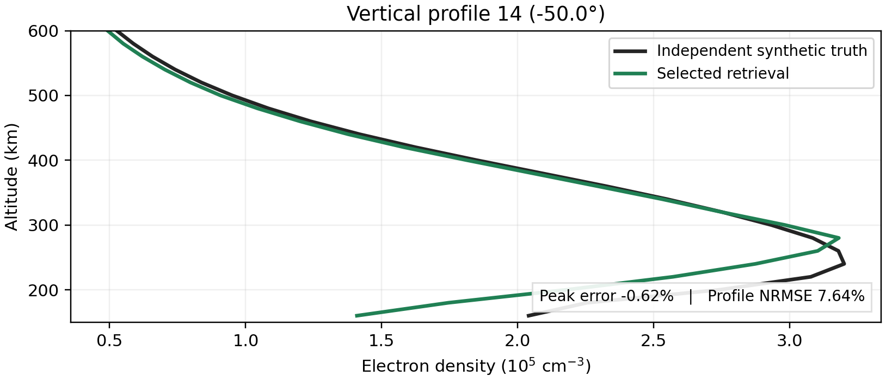
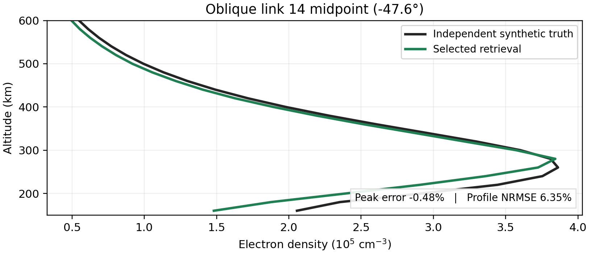

## Summary

This report compares two retrievals of the **same synthetic latitude-wave ionosphere**. First, 20 vertical O/X ionograms constrain a density field. Next, 20 two-satellite oblique O/X ionograms refine that field using 600 km along-track links. Both spacecraft are at 800 km altitude. Each sweep covers 2–10 MHz in 0.1 MHz steps, with a 1 km receiver-homing gate. The plots show every saved accepted return, with O in blue and X in red.

The vertical retrieval reproduces the peak-density wave and has **1.73% mean absolute F2 peak-density error** at the 20 sounder positions. The oblique update improves its own observable score and the density-profile RMS error at link midpoints, but midpoint peak-density and peak plasma-frequency errors rise. It improves peak-height error, although both retrievals place the F2 peak too high on average. The two geometries sample different locations, so their errors are not a direct accuracy ranking.

| Evaluation across 20 locations | Vertical selected | Oblique starting field | Oblique selected |
|:--|--:|--:|--:|
| Locations | Sounder positions | Link midpoints | Link midpoints |
| Mean absolute F2 peak-density error | 1.73% | 1.77% | 2.33% |
| Mean profile NRMSE, 150–600 km | 7.03% | 7.34% | 6.21% |
| Peak plasma-frequency MAE | 0.048 MHz | 0.051 MHz | 0.064 MHz |
| F2 peak-height MAE | 11.8 km | 13.2 km | 10.1 km |
| O/X ionogram score, lower is better | 0.2301 | 0.1958 | 0.1838 |

The synthetic **density truth** is a separate Fortran IRI-2016 grid with an imposed 900 km latitude wave. The retrieval uses a PyIRI density field calibrated on an earlier single-profile ionogram, then adjusts that field with a fitted latitude wave and several ionogram-selected corrections. The next three pages give the operations and selection rules. Truth and modeled ionograms use the same PyLap ray tracer and homing procedure. Density truth was withheld from each *current* candidate selection and opened for the evaluations shown here. Earlier development used this same wave case and its truth evaluations, so this remains an exploratory synthetic test rather than a blind validation.

### Reading the figures

Ionogram range is two-way group range for vertical sounding and transmitter-to-receiver group range for oblique sounding. Four representative positions are shown for each geometry; all reported statistics use 20. Density sections show the full 20-location cut, and the altitude profiles show the same profile/link 14 seen in the ionograms. The truth and retrieved density panels in each section share one color scale; the third panel is their difference as a percentage of the local truth F2 peak.

\clearpage

## Method: starting density and first latitude-wave fit

### What “PyIRI-based” means here

PyIRI supplied a three-dimensional background electron-density grid at the pass epoch, **1 January 2010, 12:00 UTC**, using F10.7 = 120 and daily Ap = 8. It was *not* accepted as the final density. An earlier, separate single-profile IRI ionogram at the pass center was used to calibrate five transformations of each PyIRI altitude profile. Those fitted values were carried into this 20-position experiment as a fixed prior:

| Applied to each PyIRI altitude profile | Saved value | Operation |
|:--|--:|:--|
| Overall density multiplier | 0.4474 | Multiply all densities after profile changes |
| F2 height translation | −59.8 km | Move the stretched profile downward by 59.8 km |
| Bottomside/common vertical stretch | 1.272 | Stretch altitude about the original local peak |
| Extra topside stretch ratio | 1.073 | Multiply the stretch above the original peak by this ratio |
| Local F2 peak bump | +3.0646%, 20 km Gaussian width | Multiply density around the shifted local peak |

The large density multiplier compensates for the other profile transformations and the initial PyIRI/IRI mismatch; it is **not** a fitted wave amplitude or an independently measured density. The width transforms are applied by interpolating the original PyIRI profile on an altitude coordinate stretched about its local maximum, then translating it. The small Gaussian bump is applied around the resulting maximum. Magnetic, temperature, neutral, and collision inputs for forward tracing are prepared on the same grid; collision frequency is recomputed when a candidate density changes.

### First fit across the 20 vertical ionograms

The first pass fit one *shared spatial field* to all 20 O/X ionograms, instead of fitting an unrelated profile at each latitude. Let $x$ be northward distance from the pass center, $L$ its half-span, and $z_p$ the local peak altitude of the calibrated prior. The fitted density was

$$N_1(x,z)=N_{\mathrm{prior}}(x,z)\,s\left[1+b\frac{x}{L}+a\cos\left(\frac{2\pi x}{\lambda}+\phi\right)\exp\left(-\frac{(z-z_p)^2}{2\sigma^2}\right)\right].$$

The saved fit has $s=0.9960$, $b=-0.0736$, $a=0.1484$ at the local F2 peak, $\lambda=916.7$ km, $\phi=0.305$ rad at pass center, and fixed $\sigma=65$ km. The fitted amplitude is defined at the local peak; the imposed truth wave is 18% at 280 km, so those amplitudes have different definitions. Wave bearing was fixed north–south because a single fixed-longitude pass cannot estimate it.

The optimizer used the two mode-specific last-return frequencies and 920 selected median group-range samples. A fast plane-stratified group-delay approximation supplied the repeated objective evaluations; separate O/X frequency offsets and removal of each mode/frequency's median range residual absorbed proxy-model bias. The seven search variables were scale, latitude slope, wave amplitude, wavelength, phase, and two mode offsets. The search allowed 0–35% wave amplitude and 550–1500 km wavelength; it fitted O and X nuisance cutoff offsets of **+0.023 and +0.483 MHz**. Those offsets account for the proxy's mode response and are not extra electron-density parameters. Differential evolution (population factor 9, at most 28 iterations) supplied a global search, followed by Powell local minimization. **The selected density was then put through the full 3-D PyLap forward trace**; the fast proxy was only the initializer. The resulting inversion is a staged fit of a small set of density-field parameters, followed by full-ray candidate screening.

\clearpage

## Method: vertical forward checks and later corrections

For every full forward check, the density candidate is written on the common latitude–longitude–altitude grid, O and X rays are traced separately from **2 to 10 MHz every 0.1 MHz**, and accepted receiver-homed returns must meet the **1 km gate**. Vertical sounding uses the option-D equal-area guarded fan. Empty frequency/mode bins receive additional seeds; paths near the nose are continued through intermediate 20 kHz frequencies, but every saved and plotted return was traced at its displayed 100 kHz frequency. Above-nose probes check for additional branches. All accepted returns enter the score.

The ordinary O/X ionogram score, averaged over the 20 positions, is

$$S_{\mathrm{ion}}=0.55D+0.25C+0.20R.$$

$D$ is a symmetric nearest-return distance using **0.2 MHz and 25 km** as frequency and group-range scales; each distance is clipped after three scaled units. $C$ is the O/X last-return-frequency difference, divided by **0.8 MHz** and clipped at one. $R$ compares the median group range at frequencies present in both ionograms, divided by **60 km** and clipped at one. Each component averages O and X. This score compares accepted ray sets; it does not directly minimize density error. The accepted-return cutoff can be lower than the physical critical frequency when homing misses near-nose rays.

After the first joint fit, the saved retrieval evolved through the following **ionogram-selected** steps:

| Step | Candidate change and forward check | Selection |
|:--|:--|:--|
| Nose-continuation rerun | Refit the wave after denser near-nose homing, and compare it with the earlier wave field using complete 20-position ray traces | Earlier field retained: score 0.231 versus 0.252 for the refit |
| First peak refinement | Fit a smooth latitude correction from O/X cutoff residuals; apply half, full, stronger, or uniform extra peak-density corrections in a 20 km Gaussian | Smooth half-step selected; it adds 0.84–2.13% at the local peak |
| Joint second round | Propose smooth peak-height shifts from centered group-range residuals and peak-density changes from O/X cutoff residuals | Height-shift proposals failed a seven-position screen; the selected full peak step adds −1.5% to +0.9% in a 20 km Gaussian |
| Low-Doppler final round | From each mode, keep the highest accepted frequency with $|f_D|\leq15$ Hz; fit a shared constant, latitude trend, cosine, and sine at the earlier 916.7 km wavelength | A quarter of the inferred correction, −3.7% to +2.3%, applied with a 65 km Gaussian, was selected over the starting field |

For that final round the cutoff residual is converted to a first-order density fraction, $\Delta N/N\simeq2\Delta f/f$, then fitted across all 20 positions with a robust least-squares loss and a small-coefficient prior. The two tested widths were 20 and 65 km; the broader candidate advanced to the final full-pass comparison. Selection minimized **$0.7S_{\mathrm{ion}}+0.3S_{\mathrm{gate}}$**, where $S_{\mathrm{gate}}$ is the mean O/X low-Doppler cutoff error divided by 0.8 MHz and clipped at one. Nominal spacecraft speed is 8 km/s; 1 Hz rounding was checked after selection. The final selected vertical field has **no additional fitted height shift** after the initial calibration. This matters for the later hmF2 evaluation.

\clearpage

## Method: two-satellite oblique update and evaluation boundary

The oblique stage starts from the **final selected vertical density grid**, including every correction above. It does not restart from unadjusted PyIRI. The 20 links join spacecraft at 800 km altitude, 600 km apart along track, with an assumed 8 km/s northward velocity. The oblique ray generator keeps reflected O/X returns only: group range must be at least 700 km and the ray must descend at least 100 km below the spacecraft. The quasi-direct branch is therefore absent from both the saved observations and modeled candidate ionograms.

For each link, observed-minus-starting-model O/X last-return frequencies suggest a fractional peak-density correction through $2\Delta f/f$. Median group-range residuals over **2.5–4.5 MHz** suggest a reflector-height change using the proxy $\Delta h\simeq-\Delta R/1.7$. The proposed peak correction is fit in a regularized constant + latitude trend + cosine/sine basis at 916.7 km; the height correction is tried both in that basis and as a smoothed cubic spline across link midpoints. Each candidate is constructed by interpolating the starting profile at altitude minus the proposed height shift, then optionally applying a Gaussian peak-density multiplier. Full O/X ray tracing checks the proposals; the proxy formulas do not substitute for the forward model.

A **six-link pilot** screened the starting field and six correction variants with $S_{\mathrm{ion}}$. The two best updates were traced on all 20 links. The final selection minimized **$0.8S_{\mathrm{ion}}+0.2S_D$**. To calculate $S_D$, simulated Doppler is rounded to 1 Hz; each observed ray is paired with the nearest modeled ray of the same mode and frequency if its group range is within 40 km. Doppler difference is divided by 20 Hz and capped at one; an unmatched ray gets the maximum cost. The selected variant, `gain0_sigma100_height1_spline`, uses **only the spline height correction**: its peak-density gain is zero, and its local vertical shifts span **−11.4 to +5.6 km**. The 100 km Gaussian width in its name is inactive because the peak-density gain is zero.

### What was withheld

The synthetic truth density is a separate **Fortran IRI-2016** grid at one frozen epoch, with an imposed north–south wave of 900 km wavelength, 18% amplitude at 280 km, and 60 km vertical Gaussian width. Candidate construction and candidate selection in the current rounds read the saved **truth ionograms**, modeled ionograms, and candidate fields; they do not read the truth density grid. Only the post-selection evaluation opens that grid. Truth and candidate ionograms nevertheless share PyLap ray physics and much of the magnetic/collision setup. The starting PyIRI field was calibrated on an earlier IRI ionogram, and this same synthetic wave case had been evaluated during method development. The figures therefore show an **independent density-generation comparison on an exploratory case**, not a blind or independent-instrument validation.

\clearpage

## 1. Vertical retrieval: observed and modeled ionograms

The vertical inversion starts with a wave-bearing prior and applies one smooth latitude correction, selected from the O/X returns and a low-Doppler cutoff constraint. A nominal 8 km/s spacecraft speed supplies the synthetic Doppler; values were also checked after 1 Hz quantization. The selected update reduces the combined selection score from **0.2326 to 0.2117**, while the ordinary, unweighted O/X score changes from **0.2212 to 0.2301**. The low-Doppler constraint improves the fitted peak even though the ordinary ionogram score slightly worsens.

{width=91%}

\clearpage

## 2. Vertical retrieval: density cuts

The retrieved latitude–altitude section captures the alternating F2 peak structure. Its principal mismatch is below the peak, where the topside returns have weak sensitivity. Across the 20 sounder positions, mean absolute F2 peak-density error is **1.73%** and mean peak-normalized profile RMS error over 150–600 km is **7.03%**. The latter is slightly higher than the starting retrieval's 6.95%.

{width=100%}

The altitude cut below samples profile 14 at the sounder latitude, matching the third row of Figure 1. It makes the peak agreement and lower-altitude shape error visible without color-scale compression.

{width=84%}

\clearpage

## 3. Oblique retrieval: observed and modeled ionograms

The oblique run starts from the selected vertical density. Twenty northbound transmitter–receiver links, each separated by **600 km**, provide a second viewing geometry. Smooth latitude corrections are proposed from O/X cutoff and group-range residuals; the final candidate is chosen using **80% O/X ionogram score and 20% simulated Doppler score**. The mean O/X score falls from **0.1958 to 0.1838**, and the 1 Hz Doppler score from **0.2374 to 0.1976**.

{width=91%}

The **quasi-direct satellite-to-satellite branch is absent from the saved data**. This run kept only ionospheric returns at 700 km group range or greater and required each path to descend at least 100 km below the 800 km spacecraft. A quasi-direct path would start near the 600 km spacecraft spacing. Lowering the plot's range limit alone cannot recover those discarded rays.

\clearpage

## 4. Oblique retrieval: density cuts and interpretation

At the 20 link midpoints, the selected oblique correction lowers mean peak-normalized profile RMS error over 150–600 km from **7.34% to 6.21%**. It raises mean absolute F2 peak-density error from **1.77% to 2.33%**. Thus the selected candidate fits the oblique observables and overall profile better, while the local peak amplitude is worse. The selected correction shifts local profiles by roughly −11.4 to +5.6 km and adds no peak-density scale change.

{width=100%}

The cut below samples the midpoint of link 14, matching the third row of Figure 4. It is offset northward from vertical profile 14 because the receiver is 600 km along track.

{width=84%}

The oblique result **builds on the vertical retrieval**; it is not a separate inversion from an uninformative prior. The truth density is independently generated, but ray physics, geometry handling, and homing are shared. The oblique direct branch was excluded, and the simulated 1 Hz Doppler quantization is not a full instrument-noise model. An unseen wave realization and a saved quasi-direct branch are needed to assess generalization and the added value of that observable.

### Saved inputs

The frozen [vertical selection](data/lat_wave_doppler_peak_round3/final_selection.json) and [evaluation](data/lat_wave_doppler_peak_round3/evaluation.json), [oblique selection](data/oblique_wave_600km/selection.json) and [evaluation](data/oblique_wave_600km/evaluation.json), [peak evaluation](data/vertical_oblique_peak_evaluation.json), and [truth manifest](data/lat_wave_pass_manifest.json) define the results in this report.

\clearpage

## 5. Peak plasma frequency and peak height

We evaluated **foF2**, the local peak plasma frequency, and **hmF2**, the altitude of maximum electron density, at the same 20 sounder positions and 20 oblique link midpoints used above. At each horizontal position, a three-point quadratic around the largest density sample estimates the peak between the **20 km altitude grid** points. The frequency follows $f_{o}F2 = 0.00898\sqrt{N_{\mathrm{peak}}}$ MHz for $N_{\mathrm{peak}}$ in cm$^{-3}$. These are density-derived local peaks, not ionogram nose frequencies; oblique cutoff frequency is not a direct foF2 measurement.

| Field and evaluation locations | foF2 MAE | foF2 bias | hmF2 MAE | hmF2 bias |
|:--|--:|--:|--:|--:|
| Vertical selected, sounders | 0.048 MHz | −0.030 MHz | 11.8 km | +11.8 km |
| Oblique starting field, midpoints | 0.051 MHz | −0.032 MHz | 13.2 km | +13.2 km |
| Oblique selected, midpoints | 0.064 MHz | −0.060 MHz | 10.1 km | +9.8 km |

Bias is retrieved minus truth. The oblique update reduces midpoint hmF2 MAE by **3.1 km**, but raises foF2 MAE by **0.013 MHz**. Vertical hmF2 is above truth at every sounder; the oblique selected field is high at most midpoints. The truth has a latitude-dependent height wave that neither selected field fully reproduces. The largest single-location errors are **28.6 km** for vertical hmF2 and **24.4 km** for oblique hmF2.

{width=100%}

The quadratic fit reduces the artificial 20 km steps of a grid-maximum height. It does not create higher-resolution truth: the underlying density fields remain sampled every 20 km, so small height differences should not be treated as independently resolved physical structure. The earlier vertical foF2 figure of **0.047 MHz** used the sampled grid maximum; its corresponding quadratic estimate here is **0.048 MHz**.
